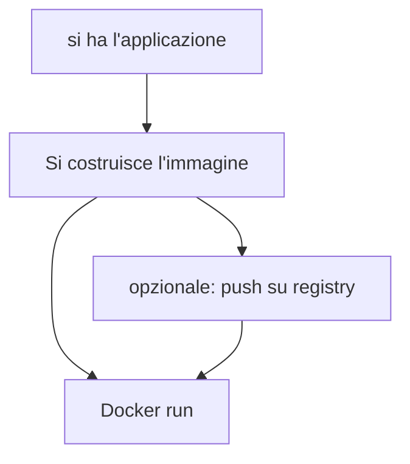

2025-05-11 16:03

Status: #baby 

Tags:
# Docker & Container
#### *Gestione di architetture a micro-servizi*
Un'architettura a microservizi è composta da mini-applicativi indipendenti, ciascuno svolgendo compiti specifici. Sebbene offra vantaggi come l'aggiornamento indipendente dei moduli e un basso accoppiamento (lo coupled), la difficoltà si sposta dalla gestione interna dell'applicazione alla gestione a livello di middleware.

Storicamente, una prima idea per gestire più applicazioni (come quelle di un'architettura a microservizi) era quella di dedicare un server per ogni applicazione. Questo approccio presenta diversi problemi:
- È uno spreco di risorse.
- È costoso
- È difficile scegliere il tipo di server ottimale per l'applicazione, potendo risultare in un investimento inadeguato se il business cresce.
- Quadruplica il lavoro del system administrator, con relativi costi.
  
Metodo delle *virtual machine (VM)*: *unico server fisico* su cui vengono eseguite *tante virtual machine*, ognuna con il suo sistema operativo e la sua applicazione.
- **migliore sfruttamento delle risorse**.
- Avere una VM dedicata per ogni applicazione può anche semplificare l'ottimizzazione della configurazione del sistema operativo per quella specifica applicazione.

Tuttavia, le virtual machine presentano un **enorme overhead**. Per far girare più VM su una macchina, ognuna con la propria istanza del sistema operativo, si spreca molto spazio e risorse. Inoltre, sono ancora necessarie più istanze di system administrator per gestire i diversi sistemi operativi, e ci sono costi per le licenze dei sistemi operativi non open source.

![[Docker_vm-1.png]]

Ed è qui che arrivano i **container**. L'idea dei container è di non avere un'istanza completa del sistema operativo per ogni applicazione, ma piuttosto una **"fetta" o "slice" del sistema operativo** dedicata. 

> [!definizione] container
> **sezione di sistema operativo completamente isolata** dalle altre, con una configurazione personale al suo interno, dove viene eseguita un'applicazione.

Il container **contiene al suo interno tutto ciò che serve all'applicazione per funzionare**: la configurazione, una fetta di sistema operativo, le librerie e le dipendenze. Questa caratteristica rende i container **altamente portatili**; un container può essere spostato dal computer di sviluppo al server aziendale o al cloud e continuerà a funzionare allo stesso modo. Questo aspetto ha contribuito enormemente alla diffusione di Docker.

Dal punto di vista concettuale, i container possono essere visti come una **virtualizzazione molto leggera** del sistema operativo. Appaiono come mini virtual machine separate, ma a basso livello non c'è una vera virtualizzazione completa; il sistema operativo è semplicemente "tagliato a fette".

Uno dei concetti chiave di Docker è l'**immagine**. 

> [!definizioneviola] Immagine
> *pacchetto* che racchiude l'applicazione e tutto ciò che serve per eseguirla all'interno di un container.
> Contiene l'applicazione, le dipendenze, e la configurazione della "fetta" di sistema operativo.
> 

Una volta creata un'immagine, essa può essere **distribuita** tramite **registri** come **Docker Hub**. Questo funziona in modo simile a un App Store, permettendo a chiunque di scaricare ed eseguire l'immagine.

La portabilità delle immagini è quasi totale, ma con alcune **piccole complicazioni**:

1. Il *processore*: se l'immagine contiene codice macchina compilato, deve essere compilata per l'architettura di destinazione (Intel/AMD o ARM). Le immagini più comuni su Docker Hub spesso hanno versioni per entrambe le architetture.
2. Il *sistema operativo*: un'applicazione pensata per girare su Linux richiede una fetta di Linux, mentre una pensata per Windows richiede una fetta di Windows. Un'immagine basata su Windows può girare solo su Windows. Per questo motivo, le immagini basate su Linux sono più diffuse, poiché possono essere eseguite su quasi tutte le piattaforme.

Per "containerizzare" un'applicazione, si deve scrivere un **Dockerfile**. Questo file specifica come costruire l'immagine. Le istruzioni chiave di un Dockerfile includono:

- Dichiarare l'**immagine di base** su cui si appoggia (ad esempio, un'immagine con JDK per un'applicazione Java).
- **Copiare** i file necessari (come il file JAR dell'applicazione) all'interno dell'immagine.
- Specificare le **porte** che si vogliono esporre verso l'esterno, poiché i container sono isolati per sicurezza e non comunicano di default con il mondo esterno.
- Definire il **comando di partenza** per eseguire l'applicazione all'avvio del container.

Una volta scritto il Dockerfile, si usa un comando per **costruire l'immagine**. L'immagine creata viene salvata in un **repository**, che può essere locale sulla macchina o remoto su Docker Hub.

**Eseguire un'immagine Docker crea un container**. *L'immagine è statica, mentre il container è un processo attivo* in esecuzione. Dalla stessa immagine, si possono creare **quante istanze di container si desidera**. Quando si esegue un container, è possibile configurare il **port mapping**, ovvero mappare una porta interna del container (quella su cui l'applicazione è in ascolto) a una porta del sistema operativo ospite, per renderla accessibile dall'esterno. All'interno di un container, è possibile accedere a una **shell** per esplorare il file system della "fetta" di sistema operativo e verificare i file copiati, come il file JAR dell'applicazione.

> [!abstract] container → mini OS
> Concettualmente, *i container sono come mini sistemi operativi isolati* che girano all'interno del sistema operativo ospite. Ognuno ha le proprie risorse (processi, memoria, disco, porte) isolate. L'isolamento intrinseco dei container è un vantaggio per la **sicurezza**, in quanto non sono accessibili dall'esterno a meno che non si espongano volontariamente porte e funzionalità specifiche.

Comandi Chiave del Dockerfile Le fonti descrivono alcuni comandi fondamentali:

- `FROM [nome_immagine : tag_immagine]`: Specifica l'*immagine di base da cui viene costruita la nostra immagine*. → l'applicativo potrebbe richiedere qualcosa di preesistente, come una Java Virtual Machine per un'applicazione Java.
  
  Ad esempio, `amazoncorretto: 23-alpine` indica la distribuzione Amazon Corretto del JDK versione 23, basata sulla distribuzione Alpine di Linux.
  
  La scelta dell'immagine di base è importante e deve essere compatibile con l'applicazione e l'host (es. un'immagine basata su Windows non gira su un Mac, che usa una VM Linux per Docker).... Le immagini basate su Linux sono comuni perché Windows può eseguire processi Linux grazie a un kernel Linux interno, mentre il viceversa non è vero, e Linux è spesso la base per application server in ambito business.
  
- `ARG [nome_variabile]`: Dichiara una variabile utilizzata all'interno del Dockerfile, non è un vero comando eseguito nel container. Nell'esempio dato, definisce JAR_file per riferirsi al file .jar generato dalla build.
  
- `COPY [origine] [destinazione]`: Copia file o cartelle dall'ambiente locale (dove si esegue il build) nel file system locale dell'immagine. Nell'esempio, copia il file .jar compilato nella cartella target del progetto nel file system interno dell'immagine con il nome app.jar.
  
- `EXPOSE [porta]`: Espone una porta interna del container, *rende la porta "esponibile", ma non la rende ancora accessibile dall'host*. Questo è un passaggio intermedio. È necessario esporre la porta su cui il servizio è in esecuzione.... *Se una porta non è esposta, possono vederla solo altri servizi all'interno dello stesso container*.
  
- `ENTRYPOINT ["comando", "param1", "param2"]`: Definisce il comando che deve essere lanciato per far partire l'applicazione quando il container viene eseguito.  Nell'esempio, `["java", "-jar", "/app.jar"]` equivale a eseguire `java -jar /app.jar8`.

> [!todo] `Docker build -t [nome: tag] “path_immagine”`
> Il nome dell'immagine appare dentro Docker. Se si intende pubblicare l'immagine su Docker Hub (il registro pubblico), è buona norma che il nome inizi con il nome del proprio repository su Docker Hub. Il tag serve a distinguere le diverse versioni dell'immagine.

> [!todo]  `docker run`
> Per eseguire un'immagine e creare un container. Durante l'esecuzione, si possono definire diverse opzioni:

Mappatura delle porte: passaggio successivo a EXPOSE.
Permette di collegare una porta interna esposta del container (es. 8555) a una porta dell'host (es. 8080). Questo è fondamentale per rendere l'applicazione *accessibile dall'esterno di Docker*, ad esempio tramite un browser sull'host. Si possono avere più container in esecuzione, tutti usando la stessa porta interna (es. 8080), ma mappati su porte diverse dell'host (es. 8080, 8081, 8082).

Delete: Elimina completamente il container.
Se lo si vuole rieseguire, bisogna rifare il processo di run dall'immagine e riconfigurare le opzioni come la mappatura delle porte
*Quando si elimina un container, anche il suo file system viene cancellato*.

Exec: Apre una shell all'interno del container. Permette di interagire con il mini file system del container (eseguire comandi come ls, whoami) e vedere i file copiati al suo interno, come l'app.jar.... Si può anche vedere il file system in una tab dedicata in Docker Desktop.

![[Docker_lower.png]]

> [!abstract] Principi Fondamentali: Namespace e Control Groups
> A basso livello, i container su Linux sono realizzati sfruttando due funzionalità preesistenti del kernel Linux:
> - Namespaces: Permettono di partizionare vari aspetti del sistema operativo, rendendoli visibili solo all'interno del namespace specifico. Esempi di aspetti partizionati: tabella dei processi, stack di rete, memoria, volumi del file system, comunicazione interprocesso (porte, MAC address, DNS), e utenti. Creando namespace, si dividono le risorse del sistema operativo.
> - Control Groups (cgroups): Permettono di limitare la quantità di risorse (CPU, RAM, disco, banda di rete) utilizzata da un certo namespace. In pratica, un container Docker è un insieme di queste due cose: un namespace con un utilizzo controllato delle risorse. Docker ha reso queste funzionalità, prima considerate complicate da usare, facilmente accessibili e impacchettate.

##### *Registri (Registry)*
Docker Quando si crea un'immagine, viene salvata in un registro locale privato sul proprio computer. Per condividere le immagini, si usano i registri Docker pubblici come Docker Hub o registri privati (usati tipicamente dalle aziende per le proprie immagini). 


##### *Architettura di Docker*
![[Docker_arc.png]]

*Docker ha un'architettura client-server*. Il client è l'interfaccia utente grafica (Docker Desktop) o la linea di comando (CLI). Il server (o Docker host) viene interpellato dal client tramite una API Rest. *Il server contiene il Docker Daemon, che attende ed esegue i comandi*. In fase di sviluppo locale, client e server spesso si trovano sullo stesso computer, ma in installazioni aziendali il server può essere remoto.

> [!caution] evitare di eseguire l'applicazione come utente root all'interno del container
> Teoricamente, un utente root all'interno del container potrebbe sfruttare primitive del sistema operativo per uscire ("escape") dal container, specialmente perché non è una macchina virtuale completa ma condivide il kernel dell'host. Per mitigare questo rischio, si possono aggiungere istruzioni al Dockerfile per creare un nuovo gruppo e utente non-root e impostare quell'utente come utente corrente per le operazioni successive
> In questo modo, l'applicazione viene eseguita con privilegi limitati (quelli dell'utente creato, es. "spring"), rendendo più difficile per un potenziale malintenzionato compiere azioni pericolose o uscire dal container....
#### *Immagini e Strati (Layers)*
Un'immagine Docker è costruita come una serie di **strati** (o _layers_) uniti a un file **manifest** che indica a Docker come gli strati devono essere "impilati".

Generalmente, ogni riga significativa nel Dockerfile corrisponde a un nuovo strato, che rappresenta una serie di modifiche rispetto allo strato precedente.
*Lo strato di base è definito dalla prima istruzione del Dockerfile, che spesso è un'immagine base del sistema operativo o un ambiente pre-configurato* (come Linux Alpine con Java Amazon Corretto 23).

È possibile visualizzare i diversi strati che compongono un'immagine Docker. Ad esempio, in un'immagine Spring Boot, i primi strati potrebbero corrispondere alla distribuzione Linux e alla JVM, mentre gli strati successivi corrispondono ai comandi eseguiti dal nostro Dockerfile (come la creazione di un utente o la copia dell'applicazione).

> [!question] condivisione degli strati
> Gli strati dell'immagine sono **readonly** (di sola lettura) e *per questo possono essere condivisi tranquillamente tra containers*.
> Docker utilizza gli **hash code** di ciascun strato per identificarli in modo univoco. Se due strati hanno lo stesso hash code, sono considerati identici e possono essere condivisi.

Docker raggiunge l'efficienza **condividendo gli strati identici** tra diversi container o immagini.
Sia quando si eseguono più container dalla stessa immagine (riutilizzo quasi totale) sia quando si usano immagini diverse che condividono gli strati di base o intermedi.

> [!idea]
> Un'applicazione pratica per sfruttare questa efficienza è quella di *suddividere l'applicazione in diversi strati* durante la creazione dell'immagine. Ad esempio, invece di copiare l'intero JAR dell'applicazione come un unico strato, si può espandere il JAR e copiare separatamente le librerie, i metadati e le classi dell'applicazione in strati distinti. Se una nuova versione dell'applicazione utilizza le *stesse librerie*, lo strato contenente le librerie (spesso il più grande) potrà essere condiviso, anche se lo strato con il codice dell'applicazione cambia.

Prima: comandi per non essere root user, un layer
```
FROM amazoncorretto:23-alpine
RUN addgroup -S spring && adduser -S spring -G spring
USER spring:spring
ARG JAR_FILE=target/*.jar
COPY ${JAR_FILE} app.jar
EXPOSE 8555
ENTRYPOINT ["java","-jar","/app.jar"]
```
Dopo: più layers. Il primo (più pesante) verrà probabilmente riutilizzato da varie versioni della mia applicazione
```
FROM amazoncorretto:23-alpine
RUN addgroup -S spring && adduser -S spring -G spring

RUN mkdir log
RUN chown spring:spring log

USER spring:spring
ARG DEPENDENCY=expand
COPY ${DEPENDENCY}/BOOT-INF/lib /app/lib
COPY ${DEPENDENCY}/META-INF /app/META-INF
COPY ${DEPENDENCY}/BOOT-INF/classes /app
ENTRYPOINT["java","-cp","app:app/lib/*",
"unito.taass.dockertest.DockertestApplication"]
EXPOSE 8555
```

(crei la cartella expand (o pippo o cosa vuoi), fai `maven clean` ,  `maven package` che costruisce la target, ti posizioni in dir e  `jar xvf ../target/nome.jar`). Così i tre comandi `COPY` sopra prenderanno i) le lib ii) le metainf iii) le classi.
*! Maven clean dopo le pull da git*

Questa strategia è particolarmente utile in *architetture a microservizi* dove molti servizi potrebbero usare lo stesso set di librerie (come Spring Boot).
##### E se un’applicazione deve scrivere dei dati?
Ad ogni strato read-only, Docker sovrappone un *writable layer*, tramite un meccanismo chiamato **Copy on Write (CoW)**, *specifico per quel singolo container*.

![[Docker_cow.png]]

Qualsiasi modifica fatta all'interno del container (come la creazione o la modifica di file) viene scritta su questo strato scrivibile.

Questo permette a **due container diversi** eseguiti dalla stessa immagine di avere stati differenti, perché ognuno ha il proprio strato scrivibile separato.

È possibile visualizzare quali file sono stati modificati o aggiunti sullo strato scrivibile ispezionando i file del container in Docker Desktop.
#### Persistenza dei Dati: Copy on Write vs. Volumi
*Le modifiche scritte sullo strato Copy on Write **persistono** se il container viene fermato e poi fatto ripartire* (stop and play). L'applicazione riprende da dove l'aveva lasciata, e il file di log (usato come esempio) rimane. Tuttavia, *se il container viene rimosso e rieseguito da zero* (anche dalla stessa immagine), *lo strato Copy on Write viene **eliminato e ricreato vuoto***. Pertanto,
###### *i dati scritti solo sullo strato CoW non persistono oltre la vita del container*
#### Volumi
Un volume Docker è essenzialmente una *cartella sul file system dell'host* (la macchina su cui gira Docker) che viene *montata* all'interno del file system del container.
- Il contenuto del volume è gestito dall'host e *non è sotto il controllo diretto di Docker*. Docker si limita a "montare" quella cartella nel container.
- Quando un container viene rimosso, il volume *non viene cancellato.
- Montare un volume *non richiede modifiche al Dockerfile*; si configura al momento dell'esecuzione del container specificando il percorso sull'host e il percorso all'interno del container dove montarlo.
- I volumi permettono anche di *condividere dati tra più container diversi, montando lo stesso volume in ciascuno di essi.*
#### Variabili di ambiente
Per rendere le immagini *configurabili a runtime senza doverle ricostruire*, si possono usare le **variabili d'ambiente**.
- Le variabili d'ambiente possono essere definite nel Dockerfile con il comando `ENV`
- Il *valore di una variabile d'ambiente può essere modificato* al momento dell'esecuzione del container → eseguire più istanze della stessa immagine con configurazioni diverse (es. specificando percorsi diversi per i log o host diversi a cui connettersi).
- Applicazioni Spring possono leggere le variabili d'ambiente usando l'annotazione `@Value`.
### **Networking in Docker**
La slice di OS dei container ha anche la parte di rete: Ogni container ha una sua **propria configurazione di rete** (indirizzo IP, porte, tabelle di routing, DNS).

> [!warning]
> La **porta virtuale interna** di un container non coincide necessariamente con la **porta dell'host**; si effettua una mappatura quando si esegue il container per permettere la comunicazione tra l'host e il container.

I container sullo stesso host sono connessi a una rete chiamata `bridge`. In questa rete di default, i container hanno indirizzi IP, ma la comunicazione diretta per nome non è agevole. 

> [!importante]
> Per far comunicare i container **tra di loro** in modo efficiente (specialmente in architetture a microservizi), è preferibile creare una **rete Docker custom**.

Il tipo di rete più comune per connettere container *sulla stessa macchina* è la **bridge network**.

> [!abstract] Bridge network custom
> permettono ai container di **comunicare per nome** (DNS), non solo per indirizzo IP. *Il nome di default è quello assegnato al container*.
> Una rete bridge custom si crea con `docker network create --driver bridge <nome_rete>`. I container vengono eseguiti o collegati a questa rete specificandola (es. con `--network <nome_rete>` in `docker run`). Questa funzionalità non è sempre disponibile nell'interfaccia grafica e potrebbe richiedere la linea di comando.
> È possibile aggiungere o rimuovere container da una rete esistente usando `docker network connect` e `docker network disconnect`.

*Se il container prova a collegarsi ad uno host nel mondo, la richiesta viene girata all’OS dell’host del container che la fa “a nome suo”*. La richiesta apparirà come fatta dall’host. L’unico domain non mappato è il localhost, che ogni container ha in se stesso.

> [!seealso] 
Per far comunicare container **su macchine host diverse** (in un'installazione distribuita), si usano le **overlay network** (il container che la crea ne è l’owner e poi gli altri si aggiungono, diventa come una rete privata). Queste richiedono l'attivazione della **modalità Swarm** di Docker (un concorrente di Kubernetes).
Altre tipologie di driver di rete esistono (none, host, macvlan, ipvlan) ma sono meno comuni o più specifiche. Kubernetes, spesso usato per l'orchestrazione, utilizza la sua propria soluzione di networking.

Ci sono altri tipi di rete: la macvlan assegna al container un indirizzo mac come se fosse un device di rete comune, ipvlan idem ma con l’indirizzo ip quindi come fossero nodi di rete.

Progetto multi-modulo Maven
- Il progetto è diviso in tre moduli: `data model` (un modulo condiviso con le classi di dati), `provider` (un servizio REST che fornisce dati), e `consumer` (un client che interroga il provider e mostra i dati).
- L'obiettivo è containerizzare il `provider` e il `consumer` separatamente e farli comunicare.
- Il `consumer` utilizza una **variabile d'ambiente** per specificare l'**hostname** del `provider`, rendendo la sua configurazione flessibile a runtime.
### Docker compose

> [!hint]
> `RestTemplate restTemplate = new RestTemplate();` classe per fare richieste Rest sincrone, cioè chi chiede sta in attesa di risposta.

`docker run -d --network nome --name dns_name -p 6655:8080 -e PROVIDER_HOSTNAME=prov:8080` . Il Consumer espone la sua porta 8080, che viene mappata su una porta diversa dell'host (nell'esempio, la 6655).

Docker compose non ha le feature di orchestrations, facilita costruzione di immagini, l’avvio di servizi su una rete docker e lo shutdown. 

Dockercompose.yaml diviso in due sezioni:
1. Servicies. definisce i singoli servizi (che poi diventeranno container).
2. Networks

```
servicies:
  provider:
    image: folder/nome:versione
    build:
      context: ./provider

  consumer:
    image: folder/nome:versione
    build:
      context: ./consumer
    depends_on:
      - provider
    ports:
    volumes:
    environment:
    networks:
```

> [!abstract]
> - Build contiene almeno context, che indica la cartella dove si trova il Dockerfile.... Opzionalmente, si può specificare dockerfile se il file non si chiama Dockerfile (utile se si raggruppano tutti i Dockerfile nella root del progetto).
> - depends_on assicura che i servizi dipendenti vengano avviati prima

> [!failure]
> Docker Compose non offre le funzionalità avanzate necessarie per un deployment realistico e affidabile, le cui 3 caratteristiche fondamentali sono:
> 1. **Monitoraggio automatizzato**: Non c'è un sistema automatico che controlla i log e lo stato dei servizi. Il monitoraggio è manuale, accedendo ai log dei container.
> 2. **Load balancing**: Compose non gestisce automaticamente la distribuzione del carico di richieste su più istanze di un servizio.
> 3. **High Availability**: Compose non rileva automaticamente se un servizio si blocca e non ne avvia una nuova istanza per garantire la continuità

> [!insight]
> prima della sua diffusione, ogni piattaforma cloud (AWS, Azure, ecc.) aveva il proprio sistema di container, rendendo il deployment specifico per ogni piattaforma e complesso da insegnare

> [!abstract]
> - `docker logs <nome_container>`: vedere logs
> - `docker compose down -v`: ferma e rimuove containers + rete + -v per i volumi

# References
