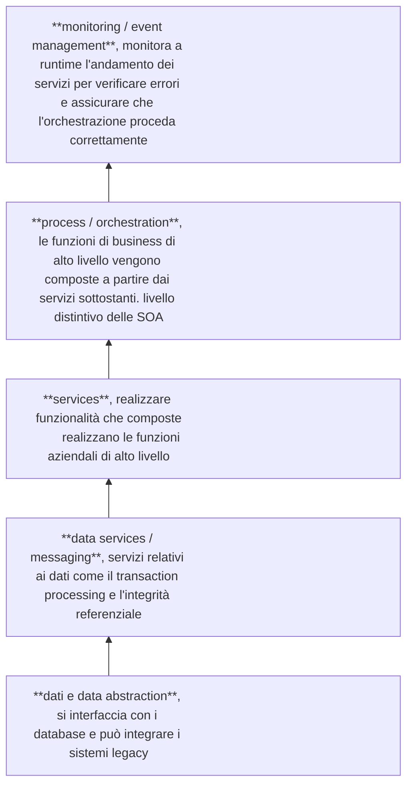
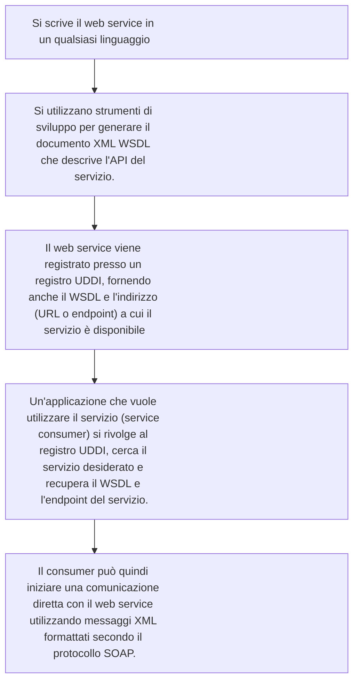
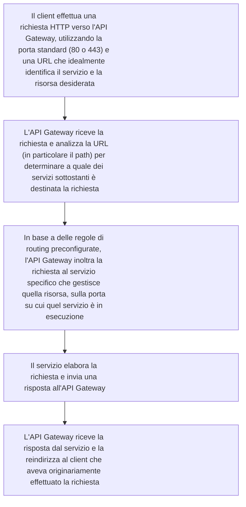

2025-06-05 14:30

Status: #child

Tags:
# Service Oriented Architectures (SOA), Web service

Nelle architetture senza servizi si trovano dei **silos**, ovvero applicazioni che realizzano funzioni aziendali ben precise (come service scheduling, order processing e account management nell'esempio). *Ognuna di queste applicazioni accede a diversi data repository, creando un forte incrocio e potenziali complessità* come errori nei dati e problemi in caso di aggiornamento di un'applicazione che gestisce dati condivisi.

L'idea alla base delle Service Oriented Architectures è di **spezzare le funzioni aziendali in servizi[^1] di più basso livello**, che possono essere utilizzati da più funzioni aziendali diverse.

- *Esigenza fondamentale*: **integrazione di diverse funzionalità** aziendali digitalizzate, spesso implementate in momenti diversi.
- *Concetto chiave*: **servizio**, definito come una componente software che enfatizza gli aspetti a runtime.

Sotto le funzioni aziendali di alto livello si trova *uno strato di servizi più piccoli e atomici*, che vengono composti per realizzare le funzionalità di alto livello.

> [!success] pro
> - Atomicità
> - Decoupling
> - Scomponendo le funzionalità in sottoservizi, è probabile che ognuno di essi acceda solo a uno dei data repository, evitando l'accesso multiplo agli stessi dati

> [!warning] Retrocompatibilità
> Devi comunque far si che un servizio aggiornato si possa interfacciar con i servizi non aggiornati, altrimenti se dovessi ogni volta aggiornare tutto sarebbe come un silos
### *Modello* **Web Services** *: strati software*

Ci sono funzionalità trasversali come la *sicurezza* (protezione, crittografia) e la *governance* (amministrazione del sistema, installazione, aggiornamenti.

Sebbene il termine "servizi web" possa sembrare generico, in realtà *"web services" denota un'architettura specifica e un insieme di protocolli specifici per la comunicazione tra servizi*:
- Non è legata a un particolare linguaggio di sviluppo
- Le applicazioni che la implementano vengono *avvolte da un web service wrapper* che le trasforma in web service, stabilendo la possibilità di *comunicare tramite protocollo XML*

> [!abstract] importanza di XML
> - Descrivere le API del servizio (quali funzioni realizza e come devono essere invocate)
> - Comunicare tra client e server (definendo il formato dei messaggi) tramite un protocollo XML chiamato SOAP (Simple Object Access Protocol), un'alternativa al protocollo HTTP
> - Registrare i servizi su un registry pubblico (UDDI - Universal Description, Discovery and Integration), permettendo a chiunque ne abbia bisogno di scoprire e interrogare i servizi

> [!idea] HTTP non solo web
> Inizialmente il web basato su HTTP era pensato per l'uso umano tramite browser, ma successivamente si è diffusa l'idea di utilizzare lo stesso tipo di comunicazione anche tra software

> [!definizioneviola] Web service
> **Oggetto software incapsulato** che offre un *insieme di funzionalità correlate*, con un'implementazione nascosta all'esterno.
> È **debolmente accoppiato** con altri servizi e **comunica tramite interfacce** chiare e pubbliche *attraverso protocolli standard*, in larga parte HTTP.
> I web service sono **disponibili in rete**, utilizzano XML per la struttura della comunicazione (nel corpo delle richieste HTTP se si usa tale protocollo) e sono indipendenti dal linguaggio specifico.

> [!info]
> - **self-describing**: tramite il WSDL indica come deve essere invocato
> - **discoverable**: grazie al registro UDDI che permette ai consumer di trovarlo

3 standard/schema XML:
- WSDL (Web Services Description Language): descrive le funzioni realizzate dal web service, la loro "signature" (come devono essere invocate) e cosa restituiscono in risposta
- SOAP (Simple Object Access Protocol): definisce come devono essere strutturati i messaggi XML scambiati tra il client e il web service
- UDDI (Universal Description, Discovery and Integration): specifica come un web service deve essere inserito in un registro anagrafico

![[webservicemodel.png]]

*La differenza tra WSDL e UDDI è che il primo descrive le funzionalità di un servizio, mentre il secondo è un'anagrafica* che fornisce informazioni sul proprietario, lo sviluppatore, i contatti e, soprattutto, l'indirizzo dove trovare il WSDL del servizio.

Funzionamento tipico di un'architettura a web service:

Sebbene l'idea di una scoperta completamente dinamica di servizi generici non abbia mai pienamente attecchito, la possibilità di scegliere dinamicamente un servizio specifico all'interno di un pool conosciuto è più comune.

*I web service basati su SOAP possono essere utilizzati in due stili di comunicazione*:
- *RPC Style* (Remote Procedure Call): il consumer chiede al servizio di eseguire una funzione e *attende una risposta* con il risultato
- *Document Style*: la richiesta del consumer è vista come un ordine (un documento), *il servizio risponde con un acknowledgement e successivamente (anche in modo asincrono) invia l'esito della richiesta* (il "prodotto" o la "fattura"). Questo stile è utile per elaborazioni di dati significative che richiedono tempo.

> [!info] Struttura messaggio SOAP
> Un messaggio SOAP è strutturato come un documento XML che contiene un **Envelope** (la busta), un **Header** (l'intestazione) e un **Body** (il corpo)

La struttura del Body dipende dallo stile di interazione: nel Document Style contiene la richiesta (l'ordine) e la risposta (l'acknowledgement con un ID), mentre nell'RPC Style contiene le invocazioni di metodi o funzioni con i relativi parametri.

> [!attention] SOAP vs REST
Una caratteristica importante di *SOAP in stile RPC* è la *possibilità di richiedere che le invocazioni di più metodi siano transazionali (ACID)*, cosa **non possibile con REST**
Questa è una ragione per cui i web service SOAP sono usati in contesti dove l'integrità delle transazioni e la sicurezza avanzata sono cruciali, tuttavia si può implementare la transazionalità anche con altri protocolli tramite middleware (L'uso di SOAP comporta l'adozione dell'intero framework (WSDL, UDDI, ecc.), mentre REST è percepito come più leggero e flessibile).

*Il WSDL è fondamentale per la capacità di self-description di un servizio*
Un documento WSDL contiene elementi chiave astratti (types, part, message, operation, portType) e concreti (service, port, binding)
*Gli elementi astratti descrivono l'interfaccia* del servizio in modo astratto (nome dell'operazione, parametri, tipi), mentre *gli elementi concreti mappano questa descrizione astratta su un effettivo endpoint e protocollo di comunicazione*.
- Types: permettono di definire tipi di dati personalizzati (base o strutturati)
- Message: definisce una struttura fatta di più "parti" di diversi tipi di dati (es. Nome, cognome, ID)
- Operation: rappresenta una delle funzioni implementate dal servizio, tendenzialmente una sequenza di messaggi scambiati (input e/o output)
- Port Type: raggruppa più operazioni realizzate dal servizio (l'interfaccia del servizio)
- Binding: specifica come le operazioni definite nel portType sono legate a un particolare protocollo di comunicazione (tipicamente SOAP). Binding: specifica come le operazioni definite nel portType sono legate a un particolare protocollo di comunicazione (tipicamente SOAP)
- Port: abbina un binding a un indirizzo di rete specifico (dove inviare il messaggio)
- Service: è un contenitore di tutti gli endpoint (le porte) di quel servizio

*In WSDL, un'operazione corrisponde a una sequenza di messaggi di input e/o output dal punto di vista del servizio*, i cui tipi di scambio possibili sono:
- One-way: il servizio riceve un input senza mandare un output.
- Request-response: il servizio riceve un input dal client e gli manda una risposta.
- Solicit-response: il servizio contatta il client per chiedergli un feedback (output iniziale, input successivo).
- Notification: il servizio semplicemente avvisa il client di qualcosa (solo output).
  
> [!question] Registro UDDI (Universal Description, Discovery and Integration).
> I dati in UDDI sono specificati in XML. **Non esiste un unico UDDI mondiale**; solitamente ci sono più UDDI, spesso gestiti da aziende per specifiche categorie merceologiche (es. Servizi turistici, carte di credito. *Un web service si registra presso UDDI fornendo un XML*.
> La diffusione degli standard come UDDI è incentivata dal fatto che la partecipazione a tali standard facilita l'interoperabilità e l'utilizzo dei servizi da parte di altre aziende, evitando la necessità di gestire standard diversi

Nel mondo Java, Jakarta Enterprise Edition (JEE) (in particolare la libreria JAX-WS - Java API for XML Web Services) fornisce standard e librerie per realizzare web service basati su SOAP e generare automaticamente il WSDL tramite Java annotations.
Nel mondo .NET, Windows Communication Framework (WCF) di Microsoft permette di creare sia web service SOAP che servizi web REST.

Per quanto riguarda l'ambiente di runtime, *i web service vengono tendenzialmente resi disponibili su application server*. Nel mondo Java, esempi di application server sono JBoss/Wildfly, WebSphere e Tomcat, mentre per Windows si possono usare Windows Server o Azure. Sebbene teoricamente un web server (che riceve le connessioni HTTP) stia davanti all'application server, spesso sono implementati come un unico bundle.
Le architetture basate su web service sono modulari, ma le architetture a microservizi sono considerate ancora più dinamiche e flessibili.
#### *implementazione di una Service Oriented Architecture (SOA) con REST*

![[restapplication.png]]

L'idea è di *avere tanti servizi, ognuno con la sua API REST*. **Ogni servizio è un'entità indipendente con una sua logica di business specifica e gestisce una o più risorse ben definite**. Un aspetto cruciale da considerare è che, tecnicamente, quando un'applicazione espone un'API tramite HTTP, deve operare su una specifica porta: Sebbene spesso non vediamo il numero di porta nelle URL che utilizziamo (come `http://www.esempio.com/api/users`), una connessione HTTP avviene sempre su una porta (la porta predefinita è la 80 per HTTP e la 443 per HTTPS).
##### *ogni servizio gira tipicamente per conto proprio su una porta differente*
##### Come fa  un client a sapere su quale porta contattare ciascun servizio?

Questo componente riceve le richieste sulla porta di default (ad esempio, la 80 per HTTP o la 443 per HTTPS), *esamina la URL della richiesta* ed è in grado di smistare il traffico ai diversi servizi in base a regole di *routing*.
L'API Gateway si occupa anche di reindirizzare le risposte al client corretto
Oltre a fare da "fronte" per le richieste API, i web service RESTful possono essere utilizzati anche da web server per generare le proprie pagine.
# References

[^1]: Un servizio è un'applicazione, di qualsiasi dimensione, che è attiva e risponde a determinate richieste, offrendo funzionalità ad altri programmi (in questo contesto spesso è B 2 B)