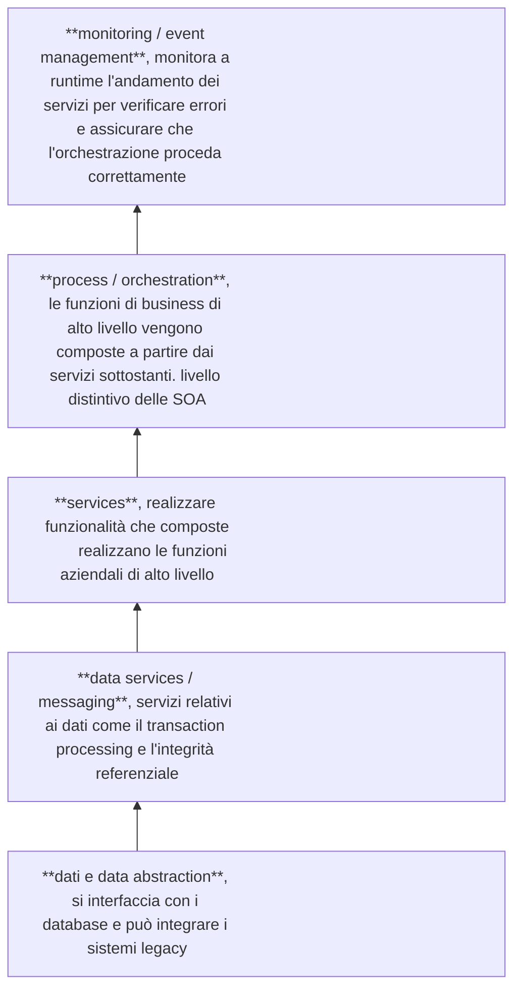
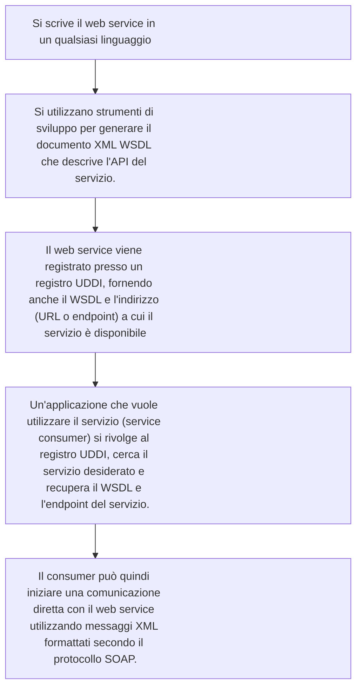
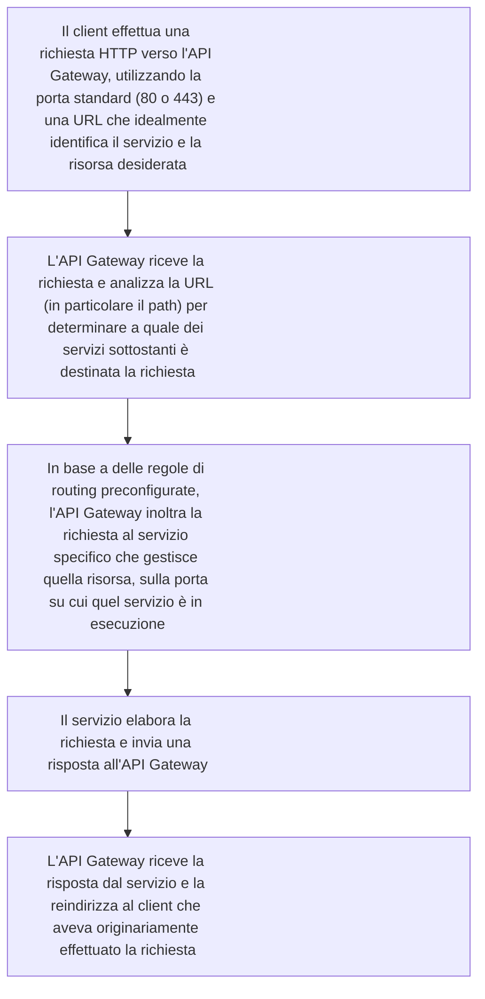

2025-04-21 18:35

Status: #baby 

Tags:
# TASS

## Legacy code - SW Architectures
Vecchie ma in azienda potrebbero esserci, le spolveriamo.
- Grande eterogeneità di strumenti, linguaggi, formati di dati e infrastrutture. Immagina un'azienda con sistemi informativi distribuiti su diverse sedi, magari nati in momenti diversi con tecnologie differenti. In questo contesto, è molto comune imbattersi nel legacy software
- Oggi, la maggior parte delle infrastrutture software, sia aziendali che non, si basa su reti che utilizzano il protocollo TCP/IP, e gran parte del software applicativo si appoggia sul protocollo HTTP. Tuttavia, in passato, non esisteva questa standardizzazione e uniformità di reti e protocolli. la rete era essenzialmente un cavo, e ciò che veniva trasmesso su quel cavo era gestito in maniera indipendente. Questo portò alla proliferazione di protocolli di rete customizzati.

![[legacy.png]]

Diversi applicativi che girano in un contesto di rete. Al centro quelli su cui si regge il business, il secondo cerchio sono gli applicativi aggiunti per rendere disponibile la digitalizzazione di alcuni servizi ex) per uniTO “f3” che gestisce registrazione ad esami.

![[legacy2.png]]

tre principali problematiche legate all'integrazione di applicazioni enterprise:
- Data consistency: garantire che i dati siano coerenti in sistemi diversi.
  L'esempio dei registri cartacei e degli statini universitari illustra bene la difficoltà di mantenere la stessa informazione (dati degli studenti, voti degli esami) in due posti diversi (il registro del docente e il libretto dello studente), dove la responsabilità della coerenza ricadeva sul singolo individuo.
  Il problema delle aule che risultavano occupate su un database e libere su un altro evidenzia come la mancanza di integrazione possa portare a incoerenze
- Multistep processes: coordinare attività aziendali che seguono una logica di processo con fasi ben precise e dipendenze tra applicativi.
  L'esempio del nuovo sistema di gestione delle domande di laurea all'Università di Torino: prevede diverse fasi, dall'inserimento della richiesta da parte dello studente, all'approvazione del titolo da parte del docente, all'assegnazione formale, alla presentazione della domanda di laurea vera e propria, fino all'invio dell'elaborato finale e all'approvazione finale del relatore. Ogni fase può coinvolgere diverse applicazioni o moduli software, e il corretto svolgimento dell'intero processo dipende dalla sincronizzazione e dal passaggio di informazioni tra questi diversi componenti
- Composite applications: integrare applicativi separati in un'unica applicazione per fornire un front-end unificato.
  Se implementato male, l'utente si troverà semplicemente di fronte a una serie di pulsanti che lo reindirizzano a diverse applicazioni separate, come spesso accade con alcune applicazioni dell'ateneo (biblioteche, pubblicazioni scientifiche)

Prima ogni dipendente aveva installato i programmi, se volevi usare un programma forse dovevi pure andare dal terminale giusto.
L’architettura client / server risolve questo problema anche.
Si parla di applicativi basati sui dati, non che fanno calcoli o altro.

l'avvento del modello client-server ha rappresentato un punto di partenza per le soluzioni integrate, portando all'idea di **architetture a strati**, tra i principali:
- Presentation: l'interfaccia con cui l'utente interagisce e che presenta i dati. il concetto di presentation possa estendersi anche ad applicazioni che offrono servizi ad altre applicazioni, dove la "presentazione" dei dati può avvenire tramite formati come JSON o XML.
- Business logic: la gestione della logica dei dati, la loro consistenza, validazione ed elaborazione....
- Data management: la gestione della persistenza e della consistenza dei dati

La suddivisione tra frontend e backend è una distinzione logica basata sul ruolo di un modulo applicativo: orientato all'utente (frontend) o alla gestione dei dati (backend), lo strato di business logic si colloca a metà, con servizi che possono essere più vicini al frontend o al backend a seconda della loro funzione
#### Come si distribuiscono i 3 strati in architetture client-server?
- Si parte da modelli arcaici dove tutto risiedeva sul server e i client erano semplici terminali senza capacità di elaborazione (come i laboratori Unix con terminali collegati a un mainframe)
- L'evoluzione ha portato a client con una limitata capacità di elaborazione per la gestione dell'interfaccia grafica (come gli X terminal)
- Un modello ancora attuale è quello dell'applicazione distribuita, tipico delle applicazioni web moderne, dove il server ospita i dati e parte della logica applicativa, offrendo servizi che vengono utilizzati da un client con piena capacità di elaborazione, in grado di eseguire logica lato client e di gestire la presentazione
- Un altro modello prevede che l'intero applicativo risieda sul client, interagendo con un database centrale unicamente per i dati tramite query SQL. Detta “*fat client*” presentava problemi di manutenzione costosa e sovraccarico del server. Per mitigare sono state introdotte soluzioni come le *stored procedure* (procedure memorizzate sul server che riducono il numero di connessioni di rete, ma limitano la portabilità) e la *replicazione asincrona dei database* (copie dei dati per migliorare scalabilità ed efficienza geografica, con implicazioni sull'integrità transazionale).
##### *Database centralizzato*
Un approccio iniziale per la gestione dei dati è stato quello del database centralizzato, dove tutti gli applicativi fanno riferimento a un unico grande database

   > [!success] PRO
   > appoggiarsi a prodotti consolidati
   > linguaggio standard di interrogazione come SQL
   > standardizzazione
   
> [!failure] Contro
> Limiti di scalabilità
#### *middleware*
Il middleware viene introdotto come quel software che si interpone tra diverse applicazioni per garantirne l'integrazione e la coerenza
Un primo esempio fondamentale di middleware è la **Remote Procedure Call (RPC)**

> [!definizione] RPC
> permettere a un applicativo client di invocare una funzione che si trova su un server in modo trasparente, come se fosse una normale chiamata di funzione locale.
> Per realizzare ciò, si utilizza un Interface Definition Language (IDL) per definire l'interfaccia tra client e server.
> Un ambiente di sviluppo compila questa descrizione e genera due componenti di codice: uno stub client (che sul client simula la funzione remota e contiene le chiamate al server) e uno stub server (che sul server riceve le richieste e invoca la funzione locale).
> I dati vengono trasferiti tra client e server attraverso processi di marshalling (mantenere la struttura complessa dei dati, inclusi i riferimenti) e serializzazione (tradurre i dati in un formato trasmissibile in rete).
> Al momento dell'invocazione, avvengono diverse fasi: il binding (individuazione del server), il marshalling e la serializzazione dei parametri, l'invio della richiesta, la ricezione, l'unmarshalling e la deserializzazione sul server, l'esecuzione della funzione, e il processo inverso per la restituzione del risultato

*La RPC rappresenta la base concettuale per molti altri middleware*

Un'evoluzione della RPC è il **TP monitor (Transaction Processing monitor)**
> [!definizione] TP Monitor
> estende le funzionalità della RPC garantendo proprietà transazionali ACID (Atomicity, Consistency, Isolation, Durability) alle chiamate remote.
> interposizione tra l'applicazione client e le risorse (dati o server), offrendo procedure di accesso transazionale e meccanismi di rollback in caso di fallimento.
> Oltre alla transazionalità, il TP monitor offre servizi di affidabilità (tramite replica dei servizi su più server), bilanciamento del carico (distribuzione delle richieste tra server), funneling (gestione del flusso di richieste per evitare sovraccarichi), e connection pooling (condivisione di risorse tra più client)
> Per implementare la transazionalità distribuita, un TP monitor può utilizzare meccanismi come il two-phase commit (2PC), che prevede una fase di preparazione e una fase di commit per garantire che una transazione su più database avvenga in modo atomico (o tutto o niente)

> [!abstract] 2-phase commit
> 1. Fase di preparazione (Preparation Phase): Il client (l'applicazione che richiede l'operazione) invia una richiesta ai diversi server coinvolti, specificando l'operazione da eseguire e chiedendo loro di prepararsi. I server verificano se sono in grado di eseguire l'operazione e possono anche tentare di eseguirla, sapendo che non devono ancora effettuare il commit finale. Il TP Monitor riceve da ciascun server l'indicazione sulla fattibilità dell'operazione.
> 2. Fase di commit (Commit Phase): Se tutti i server hanno risposto positivamente (sono pronti), il TP Monitor invia a tutti l'ordine di eseguire il commit dell'operazione. Se anche uno solo dei server rifiuta l'esecuzione, il TP Monitor ordina a tutti di eseguire il rollback, annullando le operazioni precedentemente tentate.

Il Two-Phase Commit richiede che sia il client che i server supportino questo protocollo, il che implica una gestione dello stato e degli scambi di messaggi

**Object Request Broker (ORB)** rappresenta un'evoluzione della RPC per i linguaggi di programmazione orientati agli oggetti. Invece di rendere disponibile una semplice chiamata di funzione, l'ORB espone un oggetto con tutti i suoi metodi in remoto.
Anche in questo caso si utilizza un Interface Definition Language (IDL), più complesso rispetto a quello usato con le RPC. L'IDL permette di specificare l'interfaccia dell'oggetto remoto, consentendo al client di fare riferimento a tale interfaccia e invocare i suoi metodi. L'implementazione effettiva dei metodi risiede su un oggetto sul server, chiamato servant.
L'ORB funge da *intermediario runtime tra il client e il servant*: sul client, l'ORB riceve le richieste e le trasforma in messaggi di rete, inviandoli all'ORB sul server. L'ORB del server riceve il messaggio e lo trasforma in un'invocazione del metodo sull'oggetto servant corrispondente
La comunicazione tra gli ORB avviene tramite protocolli specifici:
- GOP (General Interorb Protocol): un protocollo astratto
- IIOP (Internet Interorb Protocol): un'implementazione del GOP su TCP

> [!bug]
> L'architettura ORB è descritta come "piuttosto pesantina" a causa della complessità necessaria per far funzionare il meccanismo

> [!note]
> Un'idea interessante di CORBA (architetture storiche che hanno proposto ORB), che all'epoca non ebbe grande successo ma che è riemersa in seguito, era la possibilità per un client di scoprire dinamicamente in rete oggetti che implementavano l'interfaccia del servizio desiderato. Questo meccanismo si basava su un registro che pubblicava l'identità degli oggetti disponibili. L'obiettivo era di disaccoppiare il servizio richiesto dalla sua specifica implementazione e persino dall'indirizzo di rete del server, offrendo una sorta di "mirror" di servizi tra cui scegliere dinamicamente

Esisteva anche l'**Object Transaction Monitor (OTM)**, un sistema di middleware che combinava le funzionalità del TP Monitor e di un ORB, garantendo le proprietà ACID non sulle operazioni ma sulle invocazioni di metodi di oggetti.

Il **Message Oriented Middleware (MOM)** è un altro tipo di middleware che permette a diverse applicazioni su una stessa rete locale aziendale di comunicare in modo *asincrono* tramite l'invio di *messaggi*. A differenza della comunicazione diretta client-server, il MOM funge da intermediario che smista i messaggi.

> [!important]
> La comunicazione asincrona con MOM implica che il mittente invia un messaggio con la modalità *"fire and forget"* (manda e dimentica), senza attendere una risposta immediata. La risposta, se prevista, arriverà in un momento successivo sotto forma di un altro messaggio → **forte disaccoppiamento tra mittente e destinatario** Il mittente non necessita di conoscere l'API o l'interfaccia del destinatario; invia semplicemente un messaggio

Esistono due tipi principali di MOM:
- Point-to-point: Il messaggio ha un destinatario specifico. Una variante prevede che, una volta letto, il messaggio venga consumato e non sia più disponibile
- Publish/subscribe: Il messaggio è in broadcast su un canale, e tutti gli iscritti al canale possono riceverlo. È importante notare che, in genere, i messaggi non vengono recapitati a chi si iscrive a un topic dopo l'invio del messaggio.

JMS (Java Messaging System) è un esempio di tecnologia MOM che implementa il modello publish/subscribe.
Con i MOM, si introduce il concetto di *tecnologie push*, dove *il gestore dei messaggi può "spingere" il messaggio verso il ricevente, senza che quest'ultimo debba interrogare attivamente la coda*. Questo è legato al *paradigma* **event-driven**, in cui i servizi non aspettano di essere invocati, ma reagiscono a degli eventi (in questo caso, l'arrivo di un messaggio)

> [!attention]
> Un gestore di code di messaggi, specialmente nel modello publish/subscribe, viene definito **message broker** quando è in grado di eseguire logica applicativa sui messaggi che lo attraversano

Un message broker può, ad esempio, trasformare i messaggi (cambiare formato dati o protocollo), effettuare il rerouting dei messaggi (dirigerli verso canali diversi in base al contenuto), e garantire la persistenza dei messaggi, aumentando l'affidabilità e prevenendo la perdita di dati.

l'evoluzione dei modi di comunicazione tra applicazioni, da sistemi più accoppiati (tightly coupled) a quelli meno accoppiati (loosely coupled).
- Conversational: Scambi di informazioni con sequenze hardcoded all'interno dei programmi, con una perfetta sincronizzazione per l'intero scambio
- Request/Reply: Scambio sincrono e hardcoded, ma costituito da una singola richiesta e una singola risposta8 . Anche se le richieste HTTP sono asincrone dal punto di vista del trasporto, a livello concettuale spesso implementano un modello request/reply
- Direct Message Passing: Il client invia un messaggio al server senza attendere una risposta, risultando in uno scambio tendenzialmente asincrono. A differenza del request/reply, nel message passing non c'è una distinzione intrinseca tra richiesta e risposta; è simmetrico.
- Message Queuing: Introduce un intermediario (una coda di messaggi gestita). Il mittente invia il messaggio al gestore della coda, e il destinatario deve esplicitamente richiedere al gestore se ci sono messaggi per lui. Questo aumenta il disaccoppiamento, permettendo anche che il destinatario non sia disponibile al momento dell'invio. Tuttavia, la coda è generalmente associata a un destinatario specifico
- Publish and Subscribe: Il mittente pubblica un messaggio su un certo "topic" (argomento), e chiunque sia sottoscritto a quel topic può ricevere i messaggi. La coda di messaggi diventa accessibile a più mittenti e più destinatari, simile a una "chat di gruppo" tra servizi.
## Service Oriented Architectures SOA
Nelle architetture senza servizi, si trovano dei silos, ovvero applicazioni che realizzano funzioni aziendali ben precise (come service scheduling, order processing e account management nell'esempio). Ognuna di queste applicazioni accede a diversi data repository, creando un forte incrocio e potenziali complessità come errori nei dati e problemi in caso di aggiornamento di un'applicazione che gestisce dati condivisi.

L'idea alla base delle Service Oriented Architectures è di spezzare le funzioni aziendali in servizi[^1] di più basso livello, che possono essere utilizzati da più funzioni aziendali diverse.

- *Esigenza fondamentale*: **integrazione di diverse funzionalità** aziendali digitalizzate, spesso implementate in momenti diversi.
- *Concetto chiave*: **servizio**, definito come una componente software che enfatizza gli aspetti a runtime.

Sotto le funzioni aziendali di alto livello si trova uno strato di servizi più piccoli e atomici, che vengono composti per realizzare le funzionalità di alto livello.

> [!success] pro
> - Atomicità
> - Decoupling
> - Scomponendo le funzionalità in sottoservizi, è probabile che ognuno di essi acceda solo a uno dei data repository, evitando l'accesso multiplo agli stessi dati

> [!warning] Retrocompatibilità
> Devi comunque far si che un servizio aggiornato si possa interfacciar con i servizi non aggiornati, altrimenti se dovessi ogni volta aggiornare tutto sarebbe come un silos
### *Modello* **Web Services** *: strati software*

ci sono funzionalità trasversali come la *sicurezza* (protezione, crittografia) e la *governance* (amministrazione del sistema, installazione, aggiornamenti.

Sebbene il termine "servizi web" possa sembrare generico, in realtà "web services" denota un'architettura specifica e un insieme di protocolli specifici per la comunicazione tra servizi:
- non è legata a un particolare linguaggio di sviluppo
- Le applicazioni che la implementano vengono *avvolte da un web service wrapper* che le trasforma in web service, stabilendo la possibilità di *comunicare tramite protocollo XML*

> [!abstract] importanza di XML
> - Descrivere le API del servizio (quali funzioni realizza e come devono essere invocate)
> - Comunicare tra client e server (definendo il formato dei messaggi) tramite un protocollo XML chiamato SOAP (Simple Object Access Protocol), un'alternativa al protocollo HTTP
> - Registrare i servizi su un registry pubblico (UDDI - Universal Description, Discovery and Integration), permettendo a chiunque ne abbia bisogno di scoprire e interrogare i servizi

> [!idea] http non solo web
> Inizialmente il web basato su HTTP era pensato per l'uso umano tramite browser, ma successivamente si è diffusa l'idea di utilizzare lo stesso tipo di comunicazione anche tra software

> [!definizioneviola] web service
> **Oggetto software incapsulato** che offre un *insieme di funzionalità correlate*, con un'implementazione nascosta all'esterno.
> È **debolmente accoppiato** con altri servizi e **comunica tramite interfacce** chiare e pubbliche *attraverso protocolli standard*, in larga parte HTTP.
> I web service sono **disponibili in rete**, utilizzano XML per la struttura della comunicazione (nel corpo delle richieste HTTP se si usa tale protocollo) e sono indipendenti dal linguaggio specifico.

> [!info]
> - **self-describing**: tramite il WSDL indica come deve essere invocato
> - **discoverable**: grazie al registro UDDI che permette ai consumer di trovarlo

3 standard/schema XML:
- WSDL (Web Services Description Language): descrive le funzioni realizzate dal web service, la loro "signature" (come devono essere invocate) e cosa restituiscono in risposta
- SOAP (Simple Object Access Protocol): definisce come devono essere strutturati i messaggi XML scambiati tra il client e il web service
- UDDI (Universal Description, Discovery and Integration): specifica come un web service deve essere inserito in un registro anagrafico

![[webservicemodel.png]]

La differenza tra WSDL e UDDI è che il primo descrive le funzionalità di un servizio, mentre il secondo è un'anagrafica che fornisce informazioni sul proprietario, lo sviluppatore, i contatti e, soprattutto, l'indirizzo dove trovare il WSDL del servizio.

Funzionamento tipico di un'architettura a web service:

Sebbene l'idea di una scoperta completamente dinamica di servizi generici non abbia mai pienamente attecchito, la possibilità di scegliere dinamicamente un servizio specifico all'interno di un pool conosciuto è più comune.

I web service basati su SOAP possono essere utilizzati in due stili di comunicazione:
- RPC Style (Remote Procedure Call): il consumer chiede al servizio di eseguire una funzione e attende una risposta con il risultato
- Document Style: la richiesta del consumer è vista come un ordine (un documento), il servizio risponde con un acknowledgement e successivamente (anche in modo asincrono) invia l'esito della richiesta (il "prodotto" o la "fattura"). Questo stile è utile per elaborazioni di dati significative che richiedono tempo.

> [!info]
> Un messaggio SOAP è strutturato come un documento XML che contiene un **Envelope** (la busta), un **Header** (l'intestazione) e un **Body** (il corpo)

La struttura del Body dipende dallo stile di interazione: nel Document Style contiene la richiesta (l'ordine) e la risposta (l'acknowledgement con un ID), mentre nell'RPC Style contiene le invocazioni di metodi o funzioni con i relativi parametri.

> [!attention] SOAP vs REST
Una caratteristica importante di *SOAP in stile RPC* è la *possibilità di richiedere che le invocazioni di più metodi siano transazionali (ACID)*, cosa **non possibile con REST**
Questa è una ragione per cui i web service SOAP sono usati in contesti dove l'integrità delle transazioni e la sicurezza avanzata sono cruciali, tuttavia si può implementare la transazionalità anche con altri protocolli tramite middleware (L'uso di SOAP comporta l'adozione dell'intero framework (WSDL, UDDI, ecc.), mentre REST è percepito come più leggero e flessibile).

Il WSDL è fondamentale per la capacità di self-description di un servizio
Un documento WSDL contiene elementi chiave astratti (types, part, message, operation, portType) e concreti (service, port, binding)
Gli elementi astratti descrivono l'interfaccia del servizio in modo astratto (nome dell'operazione, parametri, tipi), mentre gli elementi concreti mappano questa descrizione astratta su un effettivo endpoint e protocollo di comunicazione.
- Types: permettono di definire tipi di dati personalizzati (base o strutturati)
- Message: definisce una struttura fatta di più "parti" di diversi tipi di dati (es. nome, cognome, ID)
- Operation: rappresenta una delle funzioni implementate dal servizio, tendenzialmente una sequenza di messaggi scambiati (input e/o output)
- Port Type: raggruppa più operazioni realizzate dal servizio (l'interfaccia del servizio)
- Binding: specifica come le operazioni definite nel portType sono legate a un particolare protocollo di comunicazione (tipicamente SOAP). Binding: specifica come le operazioni definite nel portType sono legate a un particolare protocollo di comunicazione (tipicamente SOAP)
- Port: abbina un binding a un indirizzo di rete specifico (dove inviare il messaggio)
- Service: è un contenitore di tutti gli endpoint (le porte) di quel servizio

In WSDL, un'operazione corrisponde a una sequenza di messaggi di input e/o output dal punto di vista del servizio, i cui tipi di scambio possibili sono:
- One-way: il servizio riceve un input senza mandare un output.
- Request-response: il servizio riceve un input dal client e gli manda una risposta.
- Solicit-response: il servizio contatta il client per chiedergli un feedback (output iniziale, input successivo).
- Notification: il servizio semplicemente avvisa il client di qualcosa (solo output).

Il registro UDDI (Universal Description, Discovery and Integration).
I dati in UDDI sono specificati in XML. **Non esiste un unico UDDI mondiale**; solitamente ci sono più UDDI, spesso gestiti da aziende per specifiche categorie merceologiche (es. servizi turistici, carte di credito. *Un web service si registra presso UDDI fornendo un XML*.

La diffusione degli standard come UDDI è incentivata dal fatto che la partecipazione a tali standard facilita l'interoperabilità e l'utilizzo dei servizi da parte di altre aziende, evitando la necessità di gestire standard diversi

Nel mondo Java, Jakarta Enterprise Edition (JEE) (in particolare la libreria JAX-WS - Java API for XML Web Services) fornisce standard e librerie per realizzare web service basati su SOAP e generare automaticamente il WSDL tramite Java annotations.
nel mondo .NET, Windows Communication Framework (WCF) di Microsoft permette di creare sia web service SOAP che servizi web REST.

Per quanto riguarda l'ambiente di runtime, *i web service vengono tendenzialmente resi disponibili su application server*. Nel mondo Java, esempi di application server sono JBoss/Wildfly, WebSphere e Tomcat, mentre per Windows si possono usare Windows Server o Azure. Sebbene teoricamente un web server (che riceve le connessioni HTTP) stia davanti all'application server, spesso sono implementati come un unico bundle.
Le architetture basate su web service sono modulari, ma le architetture a microservizi sono considerate ancora più dinamiche e flessibili.
## REST, Representational State Transfer
A differenza di XML Schema che ha un corrispettivo concreto, **REST è più che altro una convenzione**, un modo di utilizzare il protocollo HTTP e le URL per costruire ed esporre le API di un'applicazione disponibile **tramite HTTP**.

Non ci sono particolari vincoli sul tipo di dati che possiamo inviare, se non quelli stabiliti da HTTP stesso, che ci permette di specificare il tipo di dato nell'header content-type. la maggior parte delle applicazioni RESTful preferisce il formato JSON per lo scambio di dati, anche se occasionalmente si può trovare anche l'XML.
(Per i file più complessi come immagini o video, si usano encoding basati su stringa come il Base64, il che però presenta lo svantaggio di aumentare le dimensioni dei dati trasmessi)
##### *Un servizio web che rispetta il paradigma REST è chiamato RESTful*
L'interfaccia API di un servizio RESTful è costituita da un insieme di URL (o URI) e dal modo in cui devono essere invocate (i metodi HTTP)

Quando un client effettua una richiesta a un server, utilizza una HTTP request, e la URL della richiesta è tendenzialmente formata da più segmenti. Alcuni segmenti possono identificare il tipo di richiesta, mentre altri possono essere utilizzati come parametri della richiesta. Possiamo avere i cosiddetti path segment per identificare i parametri (come nell'esempio service/account/23, dove 23 è un parametro) oppure le query string (la parte dopo il punto di domanda nella URL) Tuttavia, una delle indicazioni di REST è di minimizzare l'utilizzo delle query string il più possibile

Un'altra caratteristica fondamentale di REST è che è molto *orientato al concetto di risorsa*: L'idea non è tanto eseguire delle funzioni, quanto accedere a delle risorse

L'idea non è tanto eseguire delle funzioni, quanto accedere a delle risorse:
- POST Crearne una nuova
- GET Ottenerne una già esistente
- PUT Aggiornare lo stato di una risorsa esistente
- DELETE Eliminare una risorsa esistente

affinché un servizio web sia restful, deve esserci una corrispondenza tra le operazioni esposte dalla sua API e questi metodi HTTP

> [!todo] HTTP codes standardizzati
> - una GET generica dovrebbe restituire un array di risorse con un codice di risposta 200 OK
> - Una POST che crea una nuova risorsa di solito restituisce la risorsa creata (magari con un ID assegnato dal server) con un codice 201 Created
> - Una DELETE di solito non restituisce niente e usa come standard la risposta 204 No Content

> [!abstract] microservizi
> Quando parliamo di microservizi su REST, tendenzialmente ogni microservizio gestisce la propria risorsa

> [!attention] l'approccio orientato alle risorse potrebbe non coprire tutte le necessità
> Ci potrebbero essere casi in cui vogliamo invocare dei servizi più in stile RPC (Remote Procedure Call), cioè eseguire una funzione passando dei parametri. In questi casi, *si utilizzano delle convenzioni per rimanere nel mondo RESTful*.
> Una di queste è che il path segment che identifica l'operazione non sarà più un nome di risorsa, ma un verbo, distinguendolo così dalle URL che accedono direttamente alle risorse. Il metodo HTTP utilizzato in questi casi dipenderà dalla natura dell'operazione: se si tratta di un'elaborazione o un calcolo, si tende ad usare il metodo GET, e i parametri dell'operazione vengono messi nella query string, se invece l'elaborazione prevede anche una manipolazione di risorse, si possono usare altri metodi come POST o PUT, soprattutto se è necessario inviare un body alla richiesta (cosa non prevista da GET e DELETE) per passare oggetti complessi.

Ci sono alcune guideline per la struttura delle URL (o URI) RESTful:
- Devono essere leggibili e intuitive, in modo che quando vediamo una URL dovremmo capire cosa fa
- Bisogna evitare di esporre le estensioni dei file, perché le URL RESTful sono logiche e non devono rivelare la tecnologia utilizzata
- tutto dovrebbe essere in minuscolo, e si usano trattini o underscore al posto degli spazi
- Le query string andrebbero evitate il più possibile, e se fatte mantenute corte ed univoche.
- gestione di URL non corrispondenti, Se una URL ricevuta è un prefisso di qualcosa che potrebbe avere senso (ad esempio, arriva una GET su `/service/account` quando ci si aspetta `/service/account/23` e il servizio non fornisce l'elenco di tutti gli account), invece di mandare un `errore 404 Not Found`, si potrebbe inviare un messaggio più specifico che indichi come proseguire (ad esempio, "`Specifica l'ID dell'account`") o che l'operazione richiesta non è supportata
### REST vs SOAP
| Caratteristica                                | REST                                                                                                                                                                            | SOAP                                                                                                                                                             |
| --------------------------------------------- | ------------------------------------------------------------------------------------------------------------------------------------------------------------------------------- | ---------------------------------------------------------------------------------------------------------------------------------------------------------------- |
| Tipo                                          | Stile architetturale                                                                                                                                                            | Protocollo strutturato (con WSDL)                                                                                                                                |
| Protocollo di trasporto                       | Usa HTTP                                                                                                                                                                        | Non vincolato a HTTP, può usare altri protocolli                                                                                                                 |
| Formato dei dati di risposta                  | Normalmente JSON, ha sostituito XML, soprattutto con tecnologie server-side basate su JavaScript. JSON è preferito per la sua sinteticità e minor "boilerplate" rispetto a XML. | Tradizionalmente XML, soprattutto nel mondo Java                                                                                                                 |
| Tipo di richiesta                             | Espresso nella URI                                                                                                                                                              | Espresso nell'endpoint                                                                                                                                           |
| Separazione operazione logica/endpoint fisico | Operazione logica e endpoint fisico sono strettamente identificati; una URI RESTful dovrebbe essere logicamente comprensibile.                                                  | Operazione logica separata dall'endpoint fisico (definito nel WSDL); una URI potrebbe essere meno significativa semanticamente.                                  |
| Compatibilità con tecnologie client           | Più adatto ad essere contattato da tecnologie client, inclusi i browser tramite JavaScript                                                                                      | Può essere più complicato e richiedere librerie specifiche                                                                                                       |
| Supporto alla transazionalità                 | Deve essere implementata diversamente                                                                                                                                           | Supporta in automatico la transazionalità delle richieste usando il protocollo Two-Phase Commit                                                                  |
| “Consapevolezza”                              | HTTP, su cui si basa REST, è definito un protocollo "stupido" o "damb" perché non ha una conoscenza intrinseca di servizi o del tipo di dati che vengono trasportati            | Protocollo "intelligente" perché è consapevole di gestire scambi di informazioni tra web service per l'esecuzione di funzionalità e la restituzione di risultati |
#### *implementazione di una Service Oriented Architecture (SOA) con REST*

![[restapplication.png]]

L'idea è di avere tanti servizi, ognuno con la sua API REST. Ogni servizio è un'entità indipendente con una sua logica di business specifica e gestisce una o più risorse ben definite. Un aspetto cruciale da considerare è che, tecnicamente, quando un'applicazione espone un'API tramite HTTP, deve operare su una specifica porta: Sebbene spesso non vediamo il numero di porta nelle URL che utilizziamo (come `http://www.esempio.com/api/users`), una connessione HTTP avviene sempre su una porta (la porta predefinita è la 80 per HTTP e la 443 per HTTPS).
##### *ogni servizio gira tipicamente per conto proprio su una porta differente*
##### Come un client fa a sapere su quale porta contattare ciascun servizio?

Questo componente riceve le richieste sulla porta di default (ad esempio, la 80 per HTTP o la 443 per HTTPS), esamina la URL della richiesta ed è in grado di smistare il traffico ai diversi servizi in base a regole di routing.
L'API Gateway si occupa anche di reindirizzare le risposte al client corretto
Oltre a fare da "fronte" per le richieste API, i web service RESTful possono essere utilizzati anche da web server per generare le proprie pagine.
### *Google Remote Procedure Call (gRPC)*
in alcuni casi può essere più opportuno orientare l'API di un servizio all'esecuzione di una funzione, richiamando il concetto di Remote Procedure Call (RPC) a un livello più alto rispetto al passato.

> [!definizioneviola] gRPC
> Protocollo di comunicazione **free open source** ed un'implementazione di RPC progettata specificamente per la comunicazione tra microservizi (a differenza di REST, nato per esporre API consumabili anche da browser). Si basa su HTTP 2 e non è adatto per la comunicazione diretta tra client (browser) e server, in quanto richiederebbe un'implementazione GRPC all'interno del browser

> [!idea]
> Un servizio client invoca una funzione su un servizio server come se fosse una funzione locale, ricevendo una risposta (Simple RPC)
##### GRPC è uno dei sistemi di comunicazione diretta tra servizi, in particolare tra microservizi, insieme a REST
A volte ha senso che un servizio invochi direttamente un altro usando REST (se l'altro servizio esiste già con un'API REST), mentre altre volte, costruendo servizi ad hoc per interagire tra loro, può essere più sensato usare GRPC. Per comunicazioni asincrone e più "loose" tra cluster di servizi indipendenti, si preferisce il message broker.

GRPC oltre alla *simple RPC* supporta altri stili di comunicazione: *server-side streaming* (il server invia continuamente dati al client), *client-side streaming* (il client invia continuamente dati al server) e *streaming bidirezionale* (entrambi inviano e ricevono stream di dati indipendenti)

![[grpc.png]]
Per l'esecuzione è necessario implementare il servizio specifico e un server GRPC in ascolto su una porta TCP.
Dal lato client, è necessaria una componente che riceve le comunicazioni (channel) e un client GRPC che permette l'invocazione della funzione remota. Gran parte del lavoro "tedioso" è gestito da GRPC stesso tramite eseguibili e librerie. Il programmatore deve descrivere il servizio e come deve essere invocato tramite i **Protocol Buffers**, che fungono da Interface Description Language (IDL).

> [!definizione] Protocol Buffers
> *Formato di serializzazione dei dati binario* (più efficiente per la trasmissione dei dati rispetto al json usato da REST), a cui si accompagna un linguaggio di specifica.
> **definisce la struttura dei messaggi** (tipi di dati) che vengono **scambiati tra client e server**.
> Utilizzando il compilatore protoC per uno specifico linguaggio, a partire dalla descrizione dello schema vengono dichiarati i tipi di dati corrispondenti, creati gli strumenti per costruire gli oggetti e generato il codice per la serializzazione e deserializzazione.

 ! *differenza fondamentale rispetto a REST*, che tipicamente usa formati testuali come XML o JSON.
 Mentre JSON non ha uno schema, i Protocol Buffers sono più simili a XML in quanto definiscono uno schema che struttura e vincola i tipi di dati scambiati
 
![[grpccode.png]]

Lo stesso linguaggio dei Protocol Buffers viene usato per descrivere un *servizio GRPC come una* *collezione di procedure* (RPC), ognuna definita con la keyword rpc, il nome della procedura, il tipo di messaggio in input e il tipo di messaggio in output.
I quattro tipi di comunicazione GRPC si ottengono combinando la possibilità per la procedura di inviare/ricevere un singolo messaggio o uno stream di messaggi.

> [!done] Language indipendent
> Per sviluppare servizi GRPC in un determinato linguaggio, è necessario scaricare il compilatore e le librerie specifiche.
> Il file .proto (il formato del Protocol Buffer schema) è l'IDL per GRPC. Il compilatore genera degli "stub" sia per il client che per il server, all'interno dei quali è possibile utilizzare classi, funzioni e moduli di libreria per implementare la logica del servizio

![[grpcaschiutettura+.png]]

In un'architettura GRPC, laddove un servizio vuole usare le funzionalità di un altro, *deve contenere un GRPC client* (ad esempio, il servizio "orders" ha un GRPC client per comunicare con "product catalog").
Per quanto riguarda il frontend (browser, mobile), in un'architettura REST si può avere un API Gateway che riceve le richieste e le indirizza al servizio appropriato senza ulteriore complessità, invece con GRPC i browser non sono in grado di effettuare direttamente richieste GRPC. È necessario uno strato intermedio che traduca le richieste provenienti dal frontend (tipicamente REST) in chiamate GRPC verso i microservizi. Questo strato intermedio può includere altri microservizi dedicati alle richieste web e mobile. Quando l'API Gateway assume questo ruolo più complesso, si parla di Backend For Frontend (BFF).
### GraphQL
linguaggio di query che permette di specificare esattamente quali informazioni ottenere da un'applicazione server, inclusa la quantità, la struttura e la profondità.

| Caratteristica                                                                 | gRPC                                                                                                                                 | GraphQL                                                                                                                                 |
|-------------------------------------------------------------------------------|-------------------------------------------------------------------------------------------------------------------------------------|-------------------------------------------------------------------------------------------------------------------------------------|
| Tipo                                                                     | Protocollo di comunicazione                                                                                                                | Linguaggio di query                                                                                                   |
| Formato dei dati di risposta                                             | Dipende dall'implementazione, ma comunemente Protobuf                                                                                                                  | JSON                                                                                                                              |
| Orientamento                                                        | Comunicazione tra servizi                                                                                                                  | Ottenimento di dati                                                                                                                              |

![[graphql.png]]

Il server GraphQL espone uno schema che definisce le strutture dati disponibili
Il client invia una query GraphQL tramite HTTP, specificando i dati desiderati, e il server restituisce un oggetto JSON con esattamente quelle informazioni.
Un caso d'uso tipico di GraphQL è la comunicazione tra frontend e backend, spesso nello strato intermedio (BFF).
*A differenza di REST, dove ottenere dati correlati può richiedere multiple richieste HTTP, GraphQL permette di specificare in un'unica query la struttura dei dati desiderati, riducendo l'overhead e il recupero di dati non necessari*
## Jakarta Enterprise Edition (JEE)

> [!abstract]
> insieme di specifiche, framework e librerie Java progettate per lo sviluppo di applicazioni aziendali di livello enterprise. caratteristiche come sicurezza, persistenza dei dati, scalabilità e affidabilità.

Storicamente, *le applicazioni JEE* venivano *eseguite in un livello intermedio tra un web server* (che gestiva le richieste HTTP tramite servlet o altre tecnologie) *e un backend* che includeva database e sistemi legacy, l’**application server**, il cui compito era quello di *erogare i servizi necessari per l'esecuzione delle applicazioni JEE*, spesso *costituite dagli* **Enterprise Java Beans** (EJBs).

![[jee.png]]

> [!caution]
> In molti casi, il web server e l'application server erano implementati nello stesso prodotto software, come ad esempio WebSphere di IBM e JBoss/Wildfly → eri vincolato al fornitore dell’application server (per sviluppare il JEE dovevi avere un server che supportasse quella logica applicativa).
> Inoltre il deploy non era standardizzato (o*ggi Docker e Kubernetes hanno notevolmente semplificato*)

> [!tip]
> Emerge l'idea che un'applicazione dovesse esporre una Application Programming Interface (API), concepita per essere utilizzata da altri programmi

Componenti di JEE:
- *JDBC(Java Database Connectivity) e JPA (Jakarta Persistence API)*: JDBC fornisce l'accesso ai database, mentre JPA è un'astrazione ORM (Object-Relational Mapping) che si occupa di tradurre le operazioni sugli oggetti Java in query SQL specifiche per il database sottostante, semplificando notevolmente lo sviluppo
- *Enterprise Java Beans (EJBs)*: Sono oggetti Java che forniscono servizi a runtime e rappresentano un elemento fondamentale per la modularizzazione delle applicazioni aziendali. Hanno fatto diffondere nel mondo Java i seguenti concetti:
	- *Inversion of Control* (IoC): Invece che essere l'oggetto utilizzatore a creare direttamente l'istanza del servizio di cui ha bisogno, con l'IoC è il framework (in questo caso l'application server) a creare e gestire le istanze dei servizi
	- *Dependency Injection* (DI): Il framework "inietta" (fornisce) le dipendenze (gli oggetti di servizio) all'interno degli oggetti che ne fanno richiesta a runtime. Questo approccio aumenta l'indipendenza tra gli oggetti e rende il codice più flessibile e testabile. Framework moderni come Spring utilizzano massicciamente questi concetti. In Spring, ad esempio, gli sviluppatori dichiarano le dipendenze, e il framework si occupa di creare e fornire gli oggetti necessari. 
	  
> [!definizioneviola] IoC , DI
> Supponiamo che al componente X serva il componente Y
> - Controllo diretto: X crea un’istanza di Y
> - Controllo rovesciato: il framework crea un’istanza di Y e la «inietta» a tutti coloro che la richiedono, fra cui X
> - Dependency injection: X «chiede» un oggetto Y nel suo costruttore, il framework glielo passa

- *Servlet*: Sono oggetti Java che rimangono in attesa di richieste HTTP e possono utilizzare gli EJB per elaborare le risposte
- *Java Server Pages* (JSP): Sono una tecnologia per la creazione di pagine web dinamiche lato server, integrandosi con gli EJB per visualizzare i dati elaborati
- Java Messaging Service (JMS): È una specifica per un Message Oriented Middleware (MOM) integrato in Jakarta EE, che consente la comunicazione asincrona e disaccoppiata tra diverse applicazioni
Sono inoltre presenti specifiche per autenticazione, autorizzazione e gestione della posta elettronica, fornendo un set completo di strumenti per lo sviluppo di applicazioni aziendali
#### *Beans*

![[Screenshot from 2025-04-23 15-18-28.png]]

- **Session Bean**: Sono responsabili dell'implementazione della logica di business e possono essere di tre tipi (dichiarati tramite *Java Annotations* come `@Stateless, @Stateful, @Singleton`):
	- Stateless: Non mantengono uno stato tra le diverse invocazioni. L'application server può fornire la stessa istanza a più client, rendendoli efficienti in termini di risorse
	- Stateful: Mantengono uno stato specifico per ogni client. L'application server crea un'istanza separata per ogni client, conservando le informazioni relative alla sessione di quel particolare utente
	- Singleton: Esiste una sola istanza per tutta l'applicazione. L'application server ne crea una sola e la condivide tra tutti i client che ne hanno bisogno, seguendo il design pattern Singleton. L'application server è responsabile della creazione e della gestione del ciclo di vita di queste istanze. 
- *Message-Driven Bean* (MDB): Sono componenti che vengono attivati dalla ricezione di un messaggio da un sistema di messaggistica (come JMS). L'application server crea un'istanza del MDB quando arriva un messaggio, lo fa elaborare e poi lo distrugge.

Gli EJB possono essere utilizzati in due modi principali:
- *Localmente*: All'interno della stessa applicazione. Un oggetto client può richiedere l'uso di un EJB semplicemente dichiarando una variabile di istanza del tipo dell'EJB e utilizzando l'annotazione `@EJB`. Il framework si occuperà di iniettare un'istanza dell'EJB nella variabile senza che il programmatore debba crearla manualmente
- *Remotamente*: Da altre applicazioni in esecuzione sullo stesso application server. In questo caso, è necessario un meccanismo più complesso che coinvolge un naming directory service. L'application server funge da object request broker e potenzialmente da TP monitor, gestendo le invocazioni remote e il bilanciamento del carico tra i diversi Bean

*L'application server mette a disposizione gli EJB all'interno di un EJB container*, in modo simile al web container per le servlet. L'EJB container fornisce l'ambiente di esecuzione (basato su una Java Virtual Machine) e gestisce il ciclo di vita degli EJB in base alla loro tipologia (stateless, stateful, singleton). Ad esempio, per un EJB stateless, il container può riutilizzare le istanze tra diverse richieste, mentre per un EJB stateful deve creare una nuova istanza per ogni client. Per un EJB singleton, il container ne mantiene una sola istanza per tutta l'applicazione.
#### Jakarta Messaging API (JMS)
*JMS realizza il concetto di MOM all'interno di Jakarta EE*, consentendo la **comunicazione asincrona e disaccoppiata** tra applicazioni. Questo significa che *il mittente e il destinatario* di un messaggio *non devono essere in esecuzione contemporaneamente e non devono conoscere i dettagli implementativi l'uno dell'altro*. La comunicazione avviene tramite code (Queues) per la messaggistica point-to-point (un messaggio ha un solo consumatore) e topic per la messaggistica publish/subscribe (più sottoscrittori possono ricevere i messaggi).

Per utilizzare JMS è necessario un provider JMS che gestisce le code e i topic. 
I client JMS (qualsiasi oggetto Java) possono connettersi al provider e inviare o ricevere messaggi. Gli oggetti chiave di JMS includono i messaggi stessi, le destinazioni (code o topic) e le Connection Factory, che vengono utilizzate per creare connessioni e sessioni per l'invio e la ricezione di messaggi.

Nel modello point-to-point (code), il mittente invia un messaggio a una coda e un solo ricevente lo consumerà, segnalando al sistema una volta processato. Nel modello publish/subscribe (topic), il publisher invia un messaggio a un topic e tutti i sottoscrittori (subscriber) interessati lo ricevono. Tuttavia, *a differenza di alcuni MOM generali, in JMS il sottoscrittore deve essere attivo* (sottoscritto e in esecuzione) *per ricevere i messaggi inviati al topic*. Se un sottoscrittore è offline, non riceverà i messaggi inviati durante la sua assenza.

[[Java Spring#Java Spring]]

# References

[^1]: Un servizio è un'applicazione, di qualsiasi dimensione, che è attiva e risponde a determinate richieste, offrendo funzionalità ad altri programmi (in questo contesto spesso è B2B)
