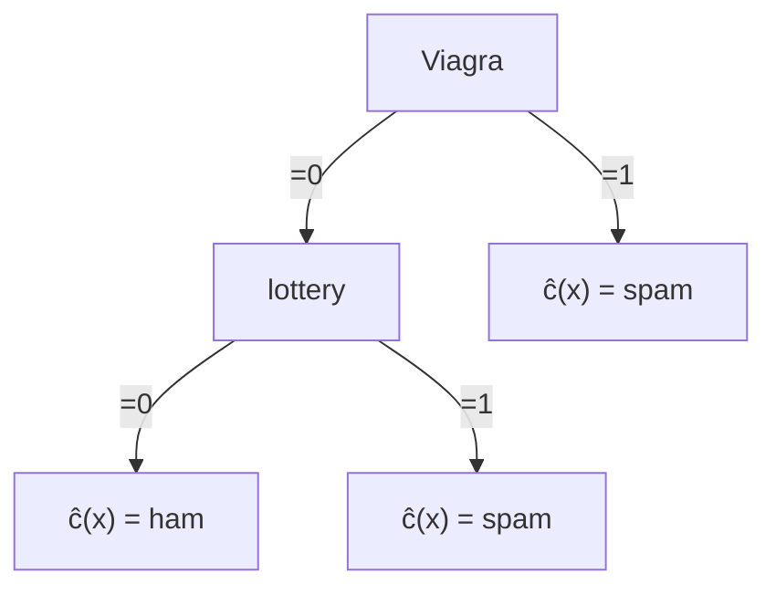

2025-02-20 18:54

Status: #adult

Tags: [[02 - Tags/Alberi|Alberi]]
# Decision Tree

> Modello di apprendimento supervisionato utilizzato per problemi di classificazione e regressione.
> Nodi → test su attributi
> Rami → risultati dei test
> Foglie → le decisioni finali o le classi

Si poggia sulla classificazione

![[Classificazione#Definizione]]

## Overfitting

Decisions Tree possono soffrire di overfitting, nella forma di un profondità ed una specializzazione delle foglie eccessive.

![[Overfitting#Definizione]]

## Pruning

Il **pruning** (potatura) è una tecnica fondamentale utilizzata nei **decision trees** (alberi decisionali) per migliorare la generalizzazione del modello e prevenire l'overfitting. Questo processo consiste nel rimuovere parti dell'albero che forniscono poco o nessun potere predittivo ai dati di test.

### Perché il Pruning è Importante?

Gli alberi decisionali possono diventare molto complessi, soprattutto quando vengono costruiti su dataset con molte features e osservazioni. Un albero troppo complesso può adattarsi perfettamente ai dati di training (overfitting), ma fallire nel generalizzare su nuovi dati. Il pruning aiuta a bilanciare la complessità dell'albero, migliorando così la sua capacità di generalizzare.

### Tipi di Pruning

Esistono due principali tecniche di pruning:

1. **Pre-pruning (o Early Stopping):**
    
    - Il processo di potatura avviene durante la costruzione dell'albero.
    - Si impongono condizioni di arresto, come una profondità massima dell'albero o un numero minimo di osservazioni per nodo.
    - Questo approccio è più veloce, ma può portare a un albero troppo semplice se le condizioni di arresto sono troppo restrittive.
2. **Post-pruning (o Cost Complexity Pruning):**
    
    - L'albero viene prima costruito completamente e poi potato.
    - Si valuta l'effetto della rimozione di ciascun nodo (ad esempio, sostituendo un subtree con una foglia la cui label è la sua majority class) e si sceglie di rimuovere quelli che non migliorano significativamente la performance del modello.
    - Questo metodo è più accurato ma computazionalmente più costoso.

### Metodi di Valutazione

Per decidere quali nodi rimuovere, si possono utilizzare diverse metriche:

- **Errore di classificazione:** Misura quanto spesso l'albero fa previsioni errate.
- **Impurità del nodo:** Utilizza misure come l'indice di Gini o l'entropia per valutare l'omogeneità dei nodi.

## Estimating Generalization Errors

Alternativa al pruning!
We add a penalty k for any leaf node. 
The penalty does not allow the creation of the leaf if it does not decrease the error of the parent node of at least k+1.

Re-substitution errors: error on training: $$\sum_{i=1}^Ne_i$$ Generalization errors: error on testing: $$\sum_{i=1}^Ne'_i$$ Without a test-set, for the estimation of the generalization error on the training set, we suppose for each leaf node i: $$ei’(t) = (ei(t)+0.5)$$ Total errors: $e’(T) = e(T) + N * 0.5$ (N: number of leaf nodes)

> [!tldr]
> Partendo ogni foglia già con un errore in più, dovrà apportare miglioramente pari o maggiore a quel valore per essere ritenuta necessaria.
##### Esempio
For a tree with 30 leaf nodes and 10 errors on training (out of 1000 instances): Training error = $10/1000 = 1\%$
Generalization error = $(10 + 30*0.5)/1000 = 2.5\%$

### Peter Flach’s recipe for Decision Trees
First and foremost, I would concentrate on getting good ranking behaviour, because from a good ranker I can get good classification and probability estimation, but not necessarily the other way round.

I would therefore try to use an impurity measure that is distribution-insensitive, such as $\sqrt{\text{Gini}}$; if that isn’t available and I can’t hack the code, I would resort to oversampling the minority class to achieve a balanced class distribution.

I would disable pruning and smooth the probability estimates by means of the Laplace correction (or the $m$ -estimate).[^1]

Once I know the deployment operation conditions, I would use these to select the best operating point on the ROC curve (i.e., a threshold on the predicted probabilities, or a labelling of the tree).[^2]

(optional) Finally, I would prune away any subtree whose leaves all have the same label.

[^1]: ![[Smoothing#Laplace Correction]]

[^2]: ![[Coverage e ROC Plot#Coverage e ROC Plot]]
