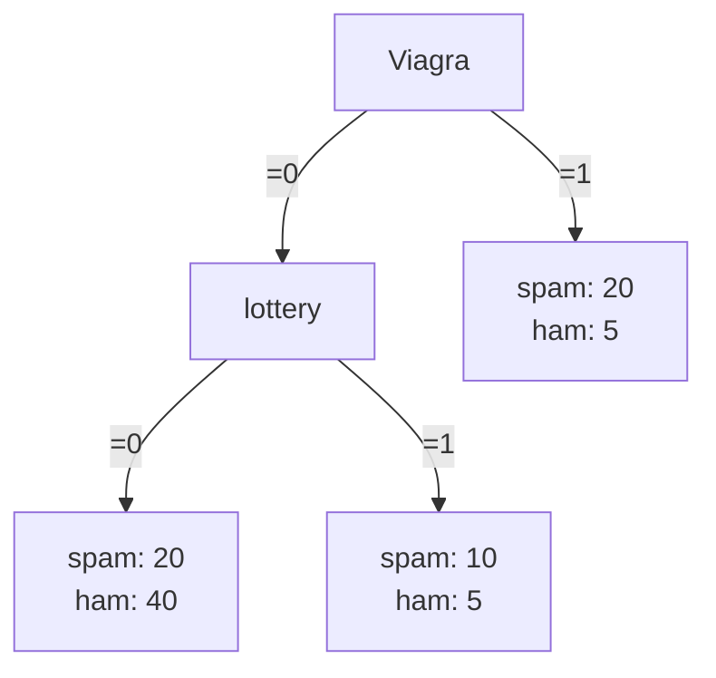

2025-02-20 18:47

Status: #adult

Tags: [[02 - Tags/Alberi|Alberi]]
# Feature Tree

> Struttura gerarchica utilizzata per rappresentare e organizzare le caratteristiche o attributi di un sistema o di un modello.
> Nodo → caratteristica specifica

Può facilmente diventare:
1. Ranking Tree, ordinando le foglie in base a non-increasing empirical probabilities
   ![[Ranking Tree#Definizione]]
2. Probability Estimator, si prevedono le probabilità empiriche in ogni foglia utilizzando il metodo di smoothing di Laplace o m-estimate per rendere la stima più robusta in foglie con pochi esempi
   ![[Probability Estimation Tree#Probability Estimation Tree]]
3. Classifier, scegliendo opportune condizioni operative.
   
### Scelta delle condizioni operative:

1. Proporzione delle frequenze delle classi:
$$ctr = \frac{NEG}{POS}$$
	Questo rappresenta il rapporto tra il numero di esempi negativi (NEG) e il numero di esempi positivi (POS).

2. Rapporto dei costi di errata classificazione:
$$c = \frac{c_{FN}}{c_{FP}}$$
    Questo è il rapporto tra il costo di un falso negativo ($c_{FN}$) e il costo di un falso positivo ($c_{FP}$).

L'obiettivo è trovare il punto operativo ottimale, noto anche come soglia di decisione, nello spazio ROC (Receiver Operating Characteristic). Questo punto si trova all'intersezione con la **curva isometrica**, che rappresenta i punti di uguale accuratezza, e ha una pendenza di $c⋅ctrc$.

- Le foglie dell'albero che si trovano prima di questo punto operativo prediranno la classe positiva.
- Le foglie rimanenti prediranno la classe negativa.

### Spiegazione del Funzionamento

La ragione per cui questo approccio funziona è legata alla pendenza delle linee nello spazio ROC:

- Se una linea con pendenza $\frac{1}{c*ctr}$ ​ ha una pendenza maggiore di un segmento $S$ con pendenza $\frac{p}{1-p}$ ​, allora non intersecherà il segmento $S$ (lo farà in uno dei segmenti precedenti nell'ordinamento).
- Una pendenza maggiore della curva isometrica rispetto al segmento $S$ indica che $S$ contiene meno esempi positivi di quanto sarebbe conveniente classificare come positivi.

Di conseguenza, il segmento $S$ classificherà gli esempi che copre come negativi, ottimizzando così la decisione in base ai costi e alle frequenze delle classi.