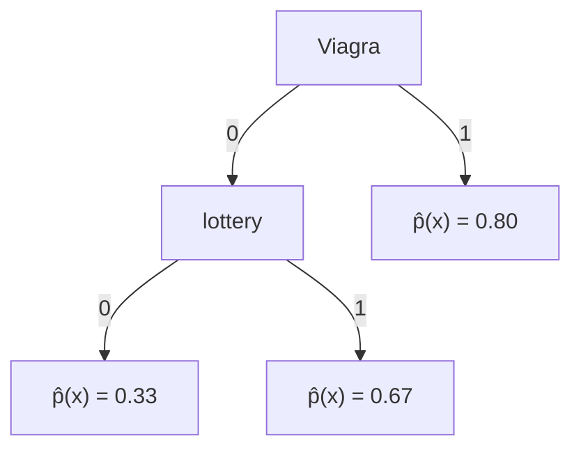

2025-02-20 18:56

Status: #child

Tags: [[02 - Tags/Alberi|Alberi]]
# Probability Estimation Tree

> Variante dei Decision Tree utilizzata per assegnare probabilità o valori a diverse opzioni o scenari.
> Nodi → scelte
> Foglie → probabilità del ramo

Si poggia sulla class probability estimation

![[Class Probability Estimation#Definizione]]

