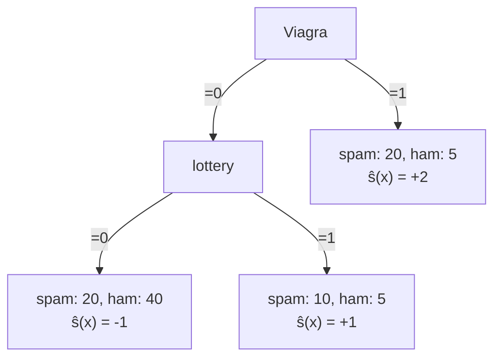

2025-02-20 18:57

Status: #adult

Tags: [[02 - Tags/Alberi|Alberi]]
# Ranking Error Rate

Definito come:
$$
\text{rank-err} = \frac{\sum_{x \in T_{E^a}, x' \in T_{E^s}} I[\hat{s}(x) < \hat{s}(x')] + \frac{1}{2} I[\hat{s}(x) = \hat{s}(x')]}{\text{Pos} \cdot \text{Neg}}
$$

- **Penalty of 1 point**: A penalty of 1 point is incurred for each ranking error, which occurs whenever a positive example is ranked below a negative one.

- **Penalty of 1/2 point**: A penalty of 1/2 point is applied for ties, which occur whenever examples from different classes are assigned the same rank.
###### Esempi
$\text{rank-err}(x_1^+, x_2^+, x_3^-, x_4^+, x_5^+, x_6^-, x_7^-, x_8^-) = \frac{2}{16} = \frac{1}{8}$
$\text{rank-err}(x_1^-, x_2^-, x_3^-, x_4^-, x_5^-, x_6^+, x_7^+, x_8^+) = \frac{15}{5 \times 3 } = 1$
##### Interpretazione grafica

1. Ordini in base allo score assegnato, decrescente
2. Sulle ordinate, ciò che classifichi come positive
3. Sulle ascisse, ciò che classifichi come negative

Rosso = 1 errore
Arancio = ½ errore
Verde = 0 errore
###### Esempio

- The 5 negatives in the right leaf are scored higher than the 10 positives in the middle leaf and the 20 positives in the left leaf, resulting in \( 50 + 100 = 150 \) ranking errors.
- The 5 negatives in the middle leaf are scored higher than the 20 positives in the left leaf, giving a further 100 ranking errors.
- In addition, the left leaf makes 800 half ranking errors (because 20 positives and 40 negatives get the same score), the middle leaf 50 and the right leaf 100.
- In total we have 725 ranking errors out of a possible 50×50=2500, corresponding to a ranking error rate of 29% or a ranking accuracy of 71%.
