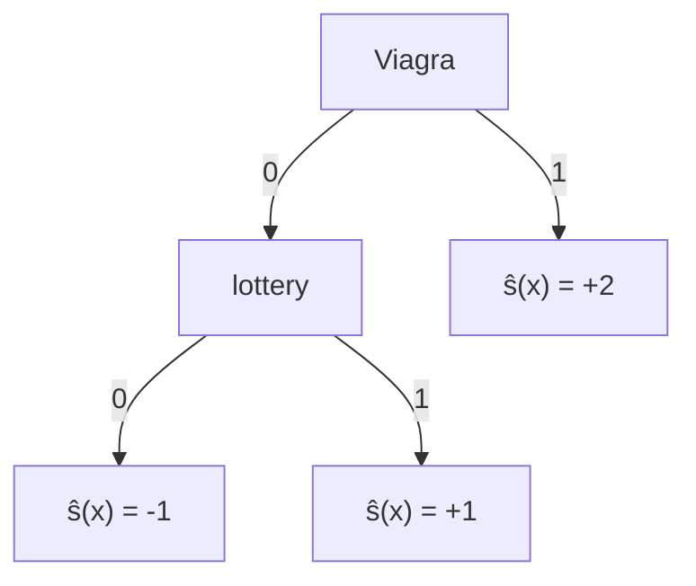

2025-02-20 18:55

Status: #adult

Tags: [[02 - Tags/Alberi|Alberi]]
# Scoring Tree

> Variante dei Decision Tree utilizzata per assegnare punteggi o valori a diverse opzioni o scenari. Ogni percorso attraverso l'albero rappresenta una sequenza di decisioni che portano a un punteggio finale

Si poggia sullo scoring classifier

![[Loss Function & Margin#Scoring classifier]]

Da uno Scoring Tree si ottiene facilmente un **Ranking Classifier** ordinando le foglie in base al punteggio dato.

Può venir applicato il ranking error rate:

![[Ranking Error Rate#Ranking Error Rate]]