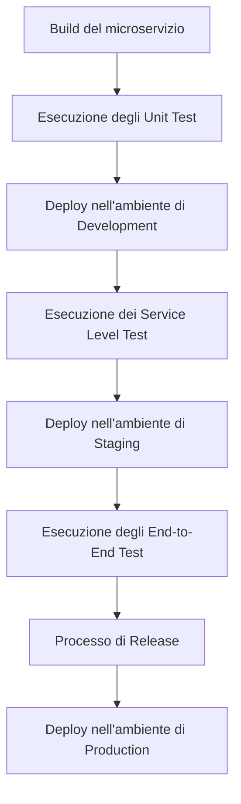

2025-05-18 12:10

Status: #baby 

Tags: [[RabbitMQ]] [[Kubernetes]]
# microservizi

Le architetture monolitiche presentano diversi inconvenienti, Downtime per aggiornamenti, Complessità crescente, Mancanza di comprensione totale, Forte interdipendenza, Paura di toccare il codice.

|                        | SOA                                                                 | Microservices                                                                                       |
|------------------------|----------------------------------------------------------------------|------------------------------------------------------------------------------------------------------|
| Scope                  | Business high level function (coarse)                                | Subdomain / single purpose (fine grained)                                                           |
| Communication          | Smart pipes (e.g. Enterprise Service Bus), heavyweight protocols     | Dumb pipes (e.g. message brokers or service-to-service with lightweight protocols - REST, gRPC)     |
| Storage                | Shared databases                                                     | Database-per-service                                                                                 |
| Deploy                 | Tightly coupled services sharing same stack                          | Loosely coupled “polyglot” services                                                                  |
| Scalability            | Difficult, due to shared dependencies                                | Highly scalable, each service scales independently                                                  |
![[microservizi.png]]

Adatti ad applicazioni orientate ai dati, la cui complessità è basata sui processi e non su computazione, meglio se diversificata su comportimenti diversi.

Lati negativi:
- La gestione di tanti servizi separati è intrinsecamente più **complessa**
- Le chiamate tra servizi (es. via REST/HTTP) sono più lente di una chiamata di metodo interna in un'applicazione monolitica
- Maggiore Attenzione alla Sicurezza

[[The cathedral and the bazaar, musings on linux and open source by an accidental revolutionary]] Conveys law: il software riflette la struttura dell’azienda → *reverse it*: struttura lazienda come vorresti il software

La filosofia e le pratiche che circondano lo sviluppo e la gestione di architetture a microservizi (tendenzialmente "cloud native") prendono il nome di **DevOps**.
#### Domain Driven Design (DDD)
Il Dominio è l'ambito di business per cui si sviluppa il software
Il Modello di Dominio è una rappresentazione formale, ma concettuale (non tecnologica), di entità, relazioni, regole e processi chiave di un dominio di business specifico. È l'output dell'analisi dei requisiti (CRC cards) e l'input della progettazione.

> [!info]
> Uno dei problemi è il linguaggio diverso tra esperti di dominio e sviluppatori. Il DDD propone di costruire un Ubiquitous Language (linguaggio onnipresente), un linguaggio comune che viene usato da entrambi e ovunque (documentazione, diagrammi, codice, nomi di classi/metodi) per evitare fraintendimenti

[[Everyday Chaos - Technology, Complexity, and How We’re Thriving in a New World of Possibility]] "tutti i modelli sono sbagliati, ma alcuni sono utili" → dividere il dominio in Subdomains (sottodomini), ognuno con il suo Ubiquitous Language

3 tipi di subdomains:
1. Generic Subdomains: Non specifici del business (es. pagamenti, gestione utenti). Spesso si usano prodotti già fatti ("off the shelf")
2. Core Domain: Il cuore del business, ciò che dà vantaggio competitivo. Qui vale la pena investire in DDD
3. Supporting Subdomains: In mezzo, non generici ma non molto complessi. Spesso basta una soluzione semplice (es. un servizio CRUD)

Il DDD ha due rami: Strategic DDD (alto livello, architettura complessiva) e Tactical DDD (basso livello, design interno dei servizi).

> [!idea] Subdomains → Bounded Context 
> è un confine concettuale intorno a una parte di un sottodominio, coeso al suo interno e con relazioni chiare e limitate con altri contesti.
> Due aree con regole troppo interdipendenti non possono essere Bounded Context separati.
> - alta coesione interna
> - basso accoppiamento con l'esterno
> - incapsulamento

Solitamente c’e corrispondenza 1:1 tra subdomain e context, ma più sottodomini possono confluire in un Bounded Context (es. per sovrapposizione di modelli, interazione stretta necessaria, o vincoli tecnologici come un database condiviso che impedisce la separazione), o un sottodominio splittarsi in più contesti (es. per chiara demarcazione funzionale o ragioni tecnologiche come frontend/backend).

> [!abstract] Comunicazione tra micros
> - Sincrona come REST
> - Async, idea “fire and forget”.
> Spesso le architetture sono ibride.

#### *Pattern di interazione fra Bounded Context,  strategic DD*
- Customer Supplier: Il pattern più semplice e tendenzialmente asimmetrico. Un bounded context (il Supplier) fornisce servizi a un altro (il Customer. La relazione è considerata *sana* se i due contesti evolvono insieme, con il Supplier che tiene conto delle esigenze del Custome
- Conformist: Si verifica in una relazione Customer Supplier non sana, dove il Supplier ignora le esigenze del Customer e forza il proprio modo di fornire servizi o la propria modellazione del dominio. Questo costringe il Customer a conformarsi, potenzialmente perdendo di vista o "corrompendo" il proprio Ubiquitous Language (il linguaggio comune del dominio)
- Anti-Corruption Layer (ACL): Uno strato che si frappone tra due bounded context (tipicamente in una situazione Conformist) per tradurre il linguaggio e le rappresentazioni dei concetti di dominio, in modo che il Customer possa mantenere il proprio Ubiquitous Language pulito. 
- Partnership: Una modalità di interazione più simmetrica dove due bounded context collaborano in maniera intensa e frequente, con scambi frequenti e linguaggi simili (**thight coupling**). 
  → un forte accoppiamento con molte comunicazioni avanti e indietro può sollevare la questione se abbia senso implementarli come due servizi separati a causa del traffico di rete
- Shared Kernel: Un modo per cercare di diminuire l'accoppiamento in una Partnership, individuando un nucleo comune di rappresentazioni/oggetti di dominio condivisi dai due bounded context e rendendolo un modulo o una libreria indipendente (potenzialmente un bounded context / micros separato).
- Separate Ways: Si decide quando due bounded context non hanno niente di rilevante in comune, anche se a prima vista potrebbero sembrare simili.anche duplicando piccole parti comuni se necessario.
#### *tactical DD*
L'approccio alla modellazione non è tipicamente top-down o bottom-up, ma incrementale e iterativo.
I principali mattoni sono:
- Entities: Rappresentano concetti rilevanti del dominio con un concetto di identità univoco. Hanno ID immutabile. Il DDD incoraggia un'implementazione ricca (Entities con comportamento e regole di business) rispetto a un'implementazione anemica (Entities solo repository di dati)
- Value Objects: Rappresentano un valore. endenzialmente, hanno attributi immutabili; cambiare un attributo crea un nuovo Value Object
- Aggregate: Una struttura che raggruppa diverse Entities e Value Objects strettamente correlati e con un ciclo di vita condiviso. All'interno di un Aggregate viene eletta una **Root Entity**: Tutte le interazioni esterne (richieste di modifica, creazione di nuovi oggetti interni) devono passare attraverso la Root Entity, che agisce come un controller per l'Aggregate, simile al principio GRASP. L'esempio è l'Aggregate "Product" con "Product" come Root Entity, che gestisce le interazioni con le sue "Product Image" (Entity) e "Packaging" (Value Object).
- Repository (opzionale): Un elemento concettuale all'interno di un bounded context che serve a *tradurre gli oggetti di dominio* (Entities, Value Objects, Aggregates) in un formato adatto alla persistenza (database, ecc.) e viceversa. Agisce come uno strato di astrazione per mantenere la purezza del modello di dominio separata dai dettagli di implementazione della persistenza.  Permette di avere una rappresentazione interna dell'oggetto consistente con l'Ubiquitous Language, mentre il Repository si occupa della trasformazione per il salvataggio/caricamento.
#### Testing
- Unit Test: Test delle singole unità di codice all'interno di un microservizio.
- Service Level Test: Test del singolo servizio in isolamento, simulando le dipendenze (integration testing dei componenti).
- End-to-End Test: Test dell'applicazione completa simulando il più possibile l'ambiente di produzione, incluse condizioni come carico e velocità di rete
#### Pipeline:

### Comunicazioni
Sincrona, il client manda Query se chiede informazioni, Command se chiede azioni.
l'attesa non implica necessariamente un "busy waiting" (il client che sta lì fermo a "ruminare"); il client a livello logico attende la risposta, ma nel frattempo potrebbe svolgere altre attività.

> [!esempio]
> Un esempio comune di comunicazione sincrona è l'interazione tra un frontend e un backend basata su REST, dove il frontend invia una richiesta HTTP e si aspetta una risposta HTTP

> [!insight] 
> è possibile implementare una comunicazione RPC Style anche usando un Message Oriented Middleware (MOM) o message broker. può avere senso se la maggior parte della comunicazione è asincrona e si dispone già di un message broker

> [!warning]
> quando un microservizio deve essere invocato direttamente dal frontend, poiché i frontend solitamente interagiscono solo tramite REST

Poiché un servizio client deve interrogare direttamente un provider, deve conoscere il suo indirizzo ed inserirlo in un file di configurazione rende difficile gestire i cambiamenti di indirizzo del provider a runtime
→ **service discovery**: mapping tra un nome logico del servizio e il suo indirizzo IP

Un provider si registra con il suo nome e IP (registration), e il client interroga il registry con il nome per ottenere l'IP (client discovery), potendo poi effettuare la richiesta. 
Oltre al DNS esiste un'altra opzione in cui la piattaforma di deployment gestisce i servizi di discovery; un modulo della piattaforma (registrar) monitora i nuovi servizi e aggiorna il registry.

> [!note]
> un servizio che scrive su un database esterno è tipicamente stateless; è il database ad essere stateful.

> [!important]
> Il backend deve sempre verificare la consistenza delle informazioni che gestisce, anche se il frontend effettua controlli per migliorare l'esperienza utente

Guasti in RPC si propagano, fanno tappo:

> [!esempio]
> Payment Service non risponde. Chi ha invocato l'Order Service non sa se l'ordine è stato completato → richieste duplicate→ intasano il Payment Service già non funzionante (quasi un attacco DoS).
> Inoltre, l'Order Service rimane bloccato in attesa della risposta dal Payment Service, saturandosi a sua volta e propagando il problema

Come impedirlo?
- *Misure interservice*: Implementate all'interno del servizio che effettua la chiamata (es. Order Service) → **meccanismi di fallback**
  Ritornare un messaggio di errore immediato, richiedere timeout oer caoire perchè l’altro servizio non risponde, restituire un valore di default o cached.
- *Misure intraservice*: Misure infrastrutturali che riguardano l'interazione tra i servizi.
  L'esempio principale è il *Service Mesh*: strato infrastrutturale che affianca un piccolo proxy ad ogni microservizio, *Il proxy si occupa di gestire i problemi, sollevando i singoli microservizi dall'implementare la logica di prevenzione guasti* (tramite timeout di rete, limitazione richieste).

Circuit Breaker Pattern
![[micros_circuitbreaker.png]]

> [!definizione] Idempotenza
> Ripetere la stessa operazione più volte consecutive ha lo stesso effetto che farla una volta sola

Se un'operazione è idempotente, le richieste duplicate non sono un problema: Le GET sono ovviamente idempotenti. Le PUT possono esserlo se sovrascrivono un valore indipendentemente da quello precedente, ma non se lo incrementano. Le DELETE sono idempotenti se la cancellazione di un elemento inesistente non causa errore. Le POST che creano nuovi elementi non sono idempotenti.

*Se un servizio non è idempotente* (ripetere la richiesta ha conseguenze indesiderate), *è necessario implementare la De-duplication* per riconoscere e scartare le richieste duplicate.

*Logical De-duplication*: Il servizio usa informazioni logiche presenti nel payload della richiesta (es. un ID ordine preesistente) per riconoscere una richiesta duplicata → può causare coupling indesiderato.

*Payload Hashing*: Il servizio genera un hash del payload e lo memorizza in una cache. Funziona solo se le richieste duplicate hanno payload esattamente identici e richieste diverse hanno payload diversi. Non funziona se il payload contiene informazioni variabili come timestamp, o se payload identici rappresentano richieste logiche distint.

*Idempotency Keys*: Il client genera un ID univoco per ogni richiesta logica e lo include nel payload10. Il server memorizza queste chiavi e scarta le richieste con una chiave già vista.
Generare la chiave lato client non è l'ideale: l'idempotenza del server dipenderebbe dal comportamento corretto del client → Il client prima richiede una chiave al server, e solo successivamente la usa per effettuare la richiesta effettiva, così oltretutto se la richiesta della chiave fallisce, il client deduce che il server è non disponibile e non procede con la richiesta che richiederebbe l'idempotency key.

Nell’asincrono tramite messaggi, Il mittente del messaggio non deve nemmeno sapere dove si trova, fisicamente o logicamente, il ricevente, Deve conoscere solo il Message Broker.

Un header importante è il Correlation ID, usato per tracciare un'unica richiesta attraverso sequenze di messaggi. 
I messaggi sono generalmente previsti per essere piccoli, idealmente sotto i 100 KB, anche se qualche MB è accettabile. Per payload molto grandi, come l'elaborazione di un file gigantesco, si usa un **blob storage**: *il file viene messo in una location dedicata e si comunicano al ricevente le credenziali o il link per accedervi*, come si fa tra umani con servizi tipo WeTransfer.

Vantaggi: il broker conserva i messaggi durante le manutenzioni, puo adottare meccanismi di controllo del flow, permette di avere multiple istanze di un servizio che gestiscono lo stesso tipo di messaggi distribuendo il carico.

Modelli di comunicazione supportati dai Message Broker:

![[microservizi_ptp.png]]

![[microservizi_fanin.png]]

![[microservizi_competing-1.png]]

Utile per distribuire il carico nelle code in cui i messaggi sono azioni da “consumare”, non importa chi li esegue.

![[microservizi_publish.png]]

Tutti i servizi che si sono iscritti a quel topic (i subscriber) ricevono una copia del messaggio. È un modello di broadcasting.

Quando si riceve messaggio → manda ACK.
ACK non arriva → duplicazione richieste
Oppure consumer rifiuta messaggio,
Oppure cosa subscriber piena.
→ **dead letter queue (DLQ)** i messaggi scaduti / duplicati / rifiutati vengono spostati qui. *Un servizio di monitoring la controlla e decide se fare replay* dei messaggi.

soprattutto con i Competing Consumers, se messaggi relativi alla stessa "transazione" o entità arrivano *fuori ordine* o vengono elaborati da consumer diversi con velocità diverse, si possono creare *incongruenze*
→ **message sharding**. Si usa *una chiave univoca* dal payload (la sharding key) *per partizionare la coda in sottocode FIFO.* I messaggi con la stessa sharding key vanno sempre alla stessa partizione e quindi allo stesso consumer, garantendo l'ordine per quella chiave (Kafka lo fa in automatico, Rabbit MQ permette di implementare una logica di routing nel broker per deviare messaggi con certi parametri su code diverse).

I broker garantiscono tipicamente la consegna almeno una volta, ma non esattamente una volta, proprio a causa dei ritentativi in caso di mancato ACK. Le soluzioni sono analoghe a quelle sincrone (idempodenza, idempodency key, ecc)

> [!warning]
> Attenzione: Con i Competing Consumers, le Idempotency Keys funzionano solo se i messaggi duplicati (e quindi con la stessa chiave) arrivano allo stesso consumer. l'Idempotency Key deve coincidere o essere derivabile dalla Sharding Key usata per partizionare la coda

Se i competing consumers sono istanze dello stesso microservizio, possono condividere un database per memorizzare le Idempotency Keys già processate, garantendo la consistenza anche se consumer diversi gestiscono messaggi per la stessa logica (ma non necessariamente duplicati)

Le Transazioni Distribuite classiche sono generalmente evitate nelle architetture a microservizi. Non sono supportate da molti DB NoSQL (come Mongo), non sono supportate dai message broker, e reintroducono i problemi di accoppiamento e blocco tipici dell'RPC.
La soluzione prevalente è il **Transactional Outbox Pattern**.
Sfrutta la transazionalità del database. *In un'unica transazione database si aggiorna il dato di business e si scrive un record che rappresenta il messaggio da inviare in una tabella/campo apposito (l'outbox)*. 
Un servizio separato, chiamato **Message Relay Service**, monitora l'outbox nel database. Quando trova nuovi messaggi, li legge, li invia al Message Broker e li marca come inviati (o li elimina).

Il message relay service può sorvegliare in due modi:
- Polling Publisher: Controlla periodicamente il database per nuovi messaggi nell'outbox. Può essere un po' pesante, soprattutto per DB NoSQL se richiede la lettura di documenti interi.
- Transaction Log Tailing: Monitora i log delle transazioni del database e ne estrae ("mines") le informazioni sugli eventi da pubblicare. Molto utilizzata.

![[microservizi_es.png]]
![[microservizi_essss.png]]
### Pattern SAGA
**scopo**: gestire la consistenza nelle architetture basate su comunicazioni asincrone.

Idealmente ogni microservizio dovrebbe possedere un database disgiunto (coupling), e ciascun tipo di dato dovrebbe essere gestito da un solo microservizio.

> [!abstract] CAP Theorem (Consistency, Availability, Partition Tolerance)
> un sistema distribuito può garantire solo due delle tre caratteristiche:
> - Partition Tolerance (P): Il sistema rimane operativo nonostante i fallimenti nella rete.
> - Availability (A): Ogni richiesta riceve una risposta, il sistema è disponibile.
> - Consistency (C): Ogni operazione di lettura riceve la versione più recente di un dato

> [!importante] 
> In un'architettura a microservizi, **la Partition Tolerance è considerata non negoziabile**: se l'applicazione si basa sulla connessione di rete tra i microservizi, deve poter funzionare anche in caso di fallimenti di rete

Quindi quale tra A e C?
Full C richiederebbe transazioni distribuite, come quelle con proprietà ACID (Atomicità, Consistenza, Isolamento, Durabilità). Ottenere l'isolamento (le transazioni non interferiscono tra loro) in un sistema distribuito è molto complesso e tecniche come il Two-Phase Commit sono pesanti e riducono l'Availability: mentre il sistema verifica ogni richiesta non può dare letture.
→ viene scelta **Availability**, cioè *si preferisce fornire una risposta anche se il dato non è la versione più aggiornata*.

Il pattern SAGA permette di preservare la disponibilità e garantire quella che viene chiamata consistenza eventuale (traduzione di 'eventual', potrebbe non essere immediata, ma sarà garantita attendendo del tempo): *I client potrebbero temporaneamente ricevere dati non aggiornati, ma a un certo punto tutte le parti del sistema convergeranno verso la versione più recente*.

Una SAGA si compone di transazioni locali prevedendo manualmente nel codice delle azioni di compensazione per evengtuali *rollback*.

> [!abstract] progettazione SAGA
> 1. *Quali transazioni locali possono fallire in modo definitivo? (Non sono ripetibili o non gestiscono richieste duplicate).*
>    Una transazione non fallisce in modo definitivo se è idempotente (può essere ripetuta senza rischi) o se gestisce richieste duplicate.
>    Nell'esempio, le operazioni non ripetibili che possono fallire definitivamente sono la Creazione dell'ordine (richiesta duplicata crea un nuovo ordine) e l'Autorizzazione della carta di credito (dipende da un servizio esterno e la ripetizione può causare problemi, come bloccare due volte la stessa cifra)
> 2. *Quali transazioni locali possono essere compensate (disfatte)?*
>    Nell'esempio, la Creazione dell'ordine può essere disfatta (rimuovendo l'ordine pendente). La Verifica utente non richiede disfacimento (è una sola lettura). L'Emissione del ticket può essere disfatta (comunicando alla cucina di cancellare il ticket). I cambiamenti di stato possono essere disfatti (ripristinando lo stato precedente). L'Autorizzazione della carta di credito, pur essendo probabilmente compensabile (annullando l'autorizzazione), è ipotizzata come complicata o non desiderabile da compensare perché si appoggia a un servizio esterno bancario.

Organizzare workflow in tre blocchi distinti:
- Blocco 1, tutte le transazioni compensabili. Per ciascuna transazione definire esplicitamente un’operazione di compensazione
- Blocco 2, *transazione pivot*. Questo è il punto di non ritorno, ultima transazione che può fallire (non necessariamente compensabile) (ex: transazione carta)
- Blocco 3, transazioni ripetibili. Ossono fallire definitivamente, a forza di ripeterle avranno successo.

Se una transazione del blocco 1 o la pivot fallisce, si invocano le rollback in ordine inverso di tutte le precedenti.
Se la pivot passa, si procede al blocco 3 → poiche sono ripetibili la SAGA è considerata riuscita.

> [!esempio]
> Nell'esempio, se l'emissione del ticket (presupposta fallibile nel Blocco 1) fallisce, si deve annullare l'operazione di emissione del ticket e poi l'operazione di creazione dell'ordine (eseguendo le compensazioni nell'ordine opposto). Se l'autorizzazione della carta (pivot) fallisce, si annulla il ticket emesso e poi si annulla la creazione dell'ordine. Se l'autorizzazione riesce, i passaggi successivi (cambiamenti di stato) sono retriable

Ci sono due modi principali per attuare la Saga:
1. **Coreografia**
   Non c'è un monitor centrale. Ogni servizio partecipante conosce la propria parte del workflow e reagisce agli eventi.
   I servizi che eseguono transazioni fallibili pubblicano messaggi di fallimento (es. ticket issue failure), i servizi che possiedono transazioni compensabili ascoltano i messaggi di fallimento e, se necessario, eseguono le loro operazioni di compensazione
   *Vantaggi*: non richiede codice aggiuntivo, facile
   **svantaggi**: difficile capire workflow complessivo. Tight coupling implicito poichè i servizi condividono assunzioni sul flusso.
2. **Orchestrazione**
   Un *orchestratore* gestisce il workflow.
   Implementa una macchina a stati, cambia stato in base ai messaggi/eventi ed invoca le operazioni.
   *vantaggi*: workflow chiaro e modificabile facilmente, minor coupling
   **svantaggi**: rischio id centralizzare troppa logica creando *god classes* (ritorno al monolite)

> [!attention]
> Anche implementando il pattern Saga, non si riesce ad avere l'Isolation. Possono verificarsi alcuni problemi dovuti alla mancanza di isolamento quando più Saga sono in esecuzione parallela:
> - Lost Updates: Due Saga modificano lo stesso dato contemporaneamente, e la modifica di una sovrascrive quella dell'altra. Esempio: due acquisti dello stesso posto per un concerto. 
> - Dirty Reads: Una Saga legge dati temporanei non ancora "committati" da un'altra Saga. Questo si lega alla consistenza eventuale. 
> - Fuzzy Reads (o Non-repeatable Reads): Una Saga legge lo stesso dato due volte e ottiene valori diversi perché un'altra Saga lo ha modificato nel frattempo. Crea inconsistenze interne nella Saga

Contromisure:
- *Semantic Locking*: Inserire manualmente dei lock nel codice o in un database di supporto (es. Redis) per proteggere i dati critici mentre una Saga li sta usando
- *Optimistic Concurrency Control*: Basato sull'idea che i conflitti siano rari. Utilizzare *timestamps* del dato.
- *Snapshotting*: Prendere una copia dei dati necessari all'inizio della Saga e lavorare su quella versione congelata per evitare dirty reads
- *Risk-based Concurrency Choice*: Decidere di usare transazioni distribuite complete (con Two-Phase Commit) solo per quelle operazioni ad altissimo rischio dove la mancanza di isolamento avrebbe conseguenze molto gravi.

# References
